## Unboxing
Here is what you can expect upon receiving your ASIC. The Antminer will be shipped in a box that reads "Antminer" on the side and has the word "Bitmain" printed on the packing tape. Not great for opsec so be prepared for that. The Whatsminer ships in a plain box with only a small holographic sticker on it with any indication of the contents.

The Antminer box measures 22"L x 17"H x 13"W. The Whatsminer box measures 21"L x 14"H x 9"W. 

  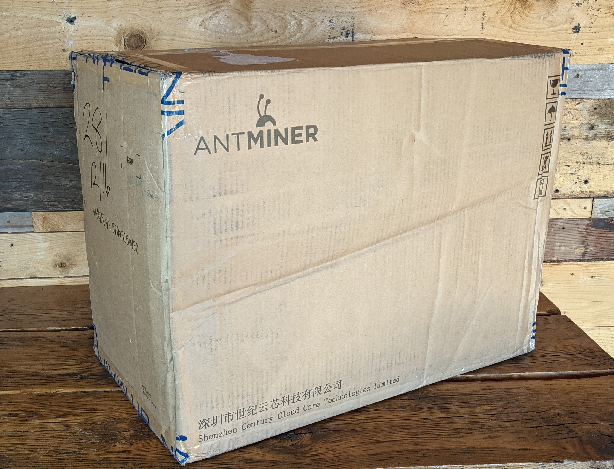
  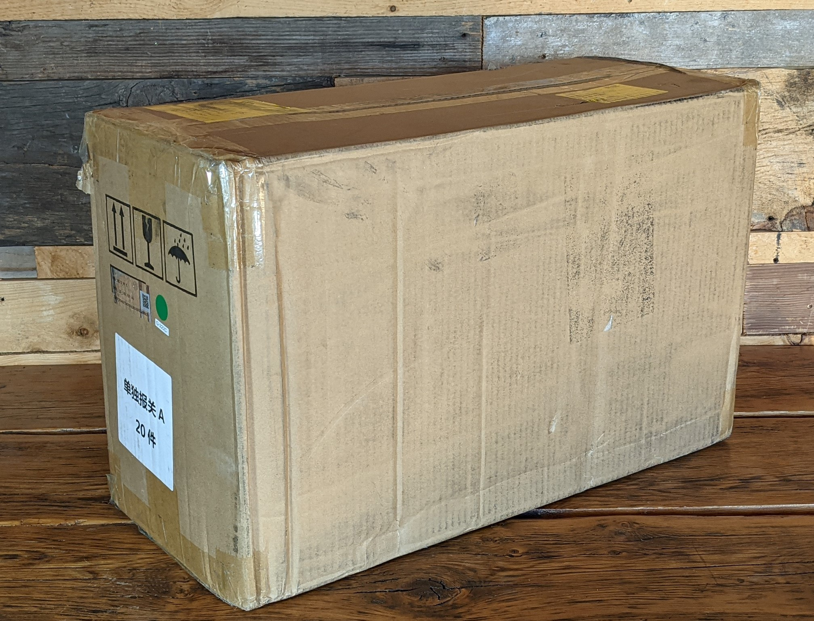

Check your box for external damage. If something doesn't look right, document the damage with pictures and contact the official Upstream Data sales team at [sales@upstreamdata.ca](mailto:sales@upstreamdata.ca) or [adam@upstreamdata.ca](mailto:adam@upstreamdata.ca). 

Inside the either box the ASIC will be packed with styrofoam:

  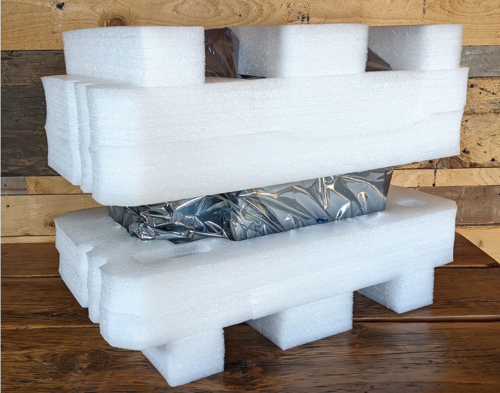
  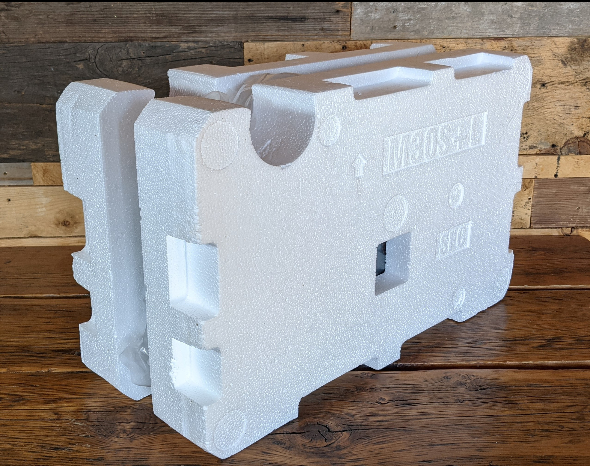

Inside the styrofoam, either ASIC will be wrapped in a plastic bag:

  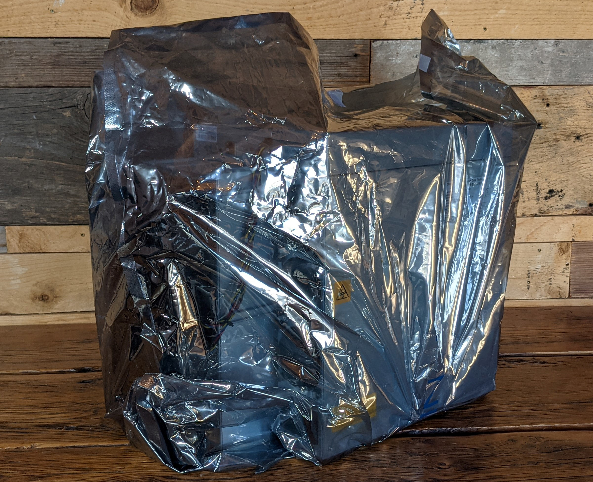
  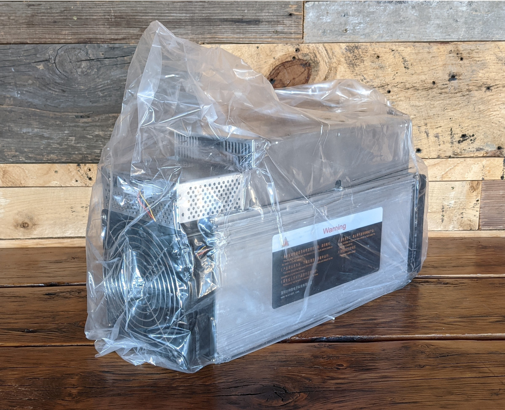

Inspect your ASIC for any visual signs of damage. Pick your ASIC up with both hands and a firm grip and shake it to see if there are any indications of loose pieces rattling around inside. 

  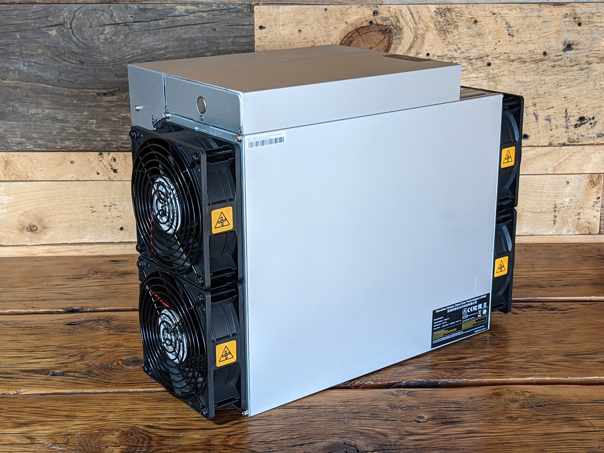
  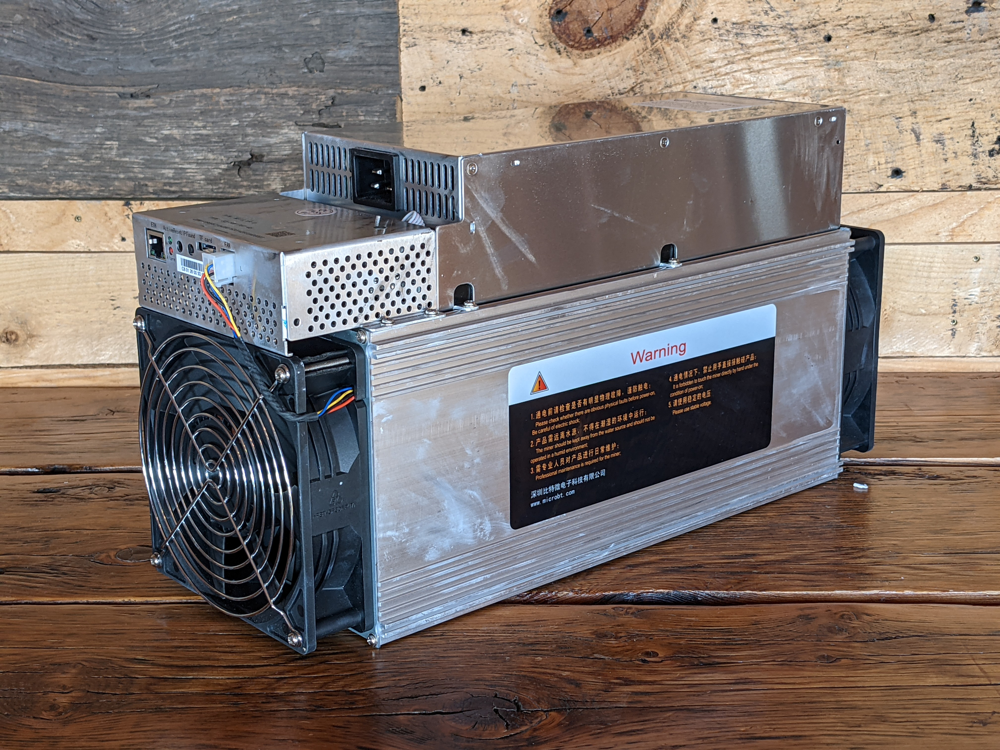
  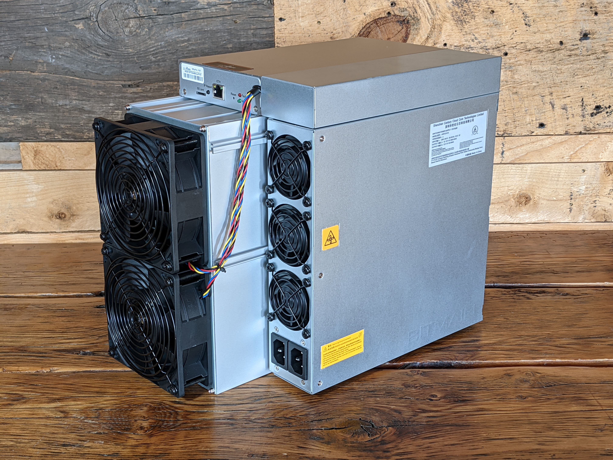
  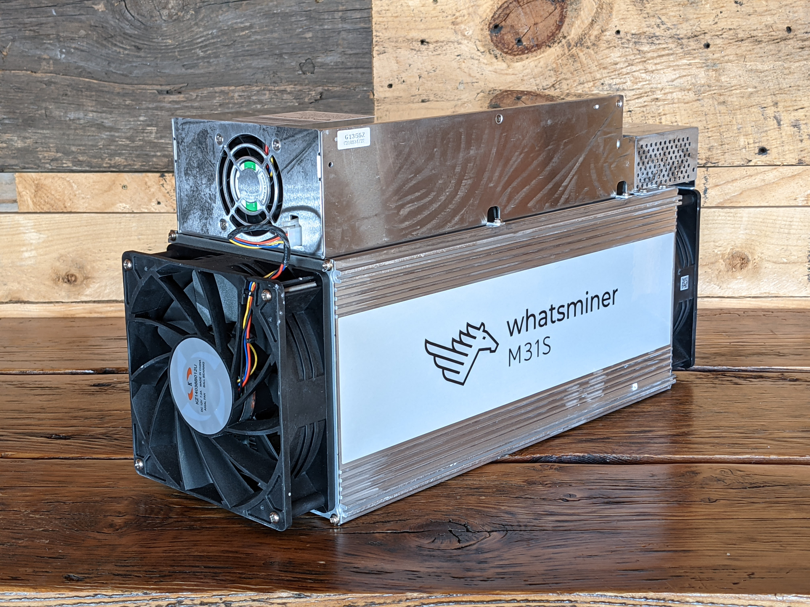

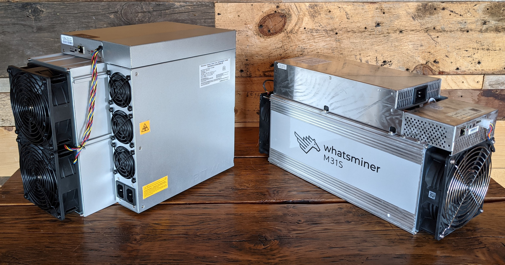

