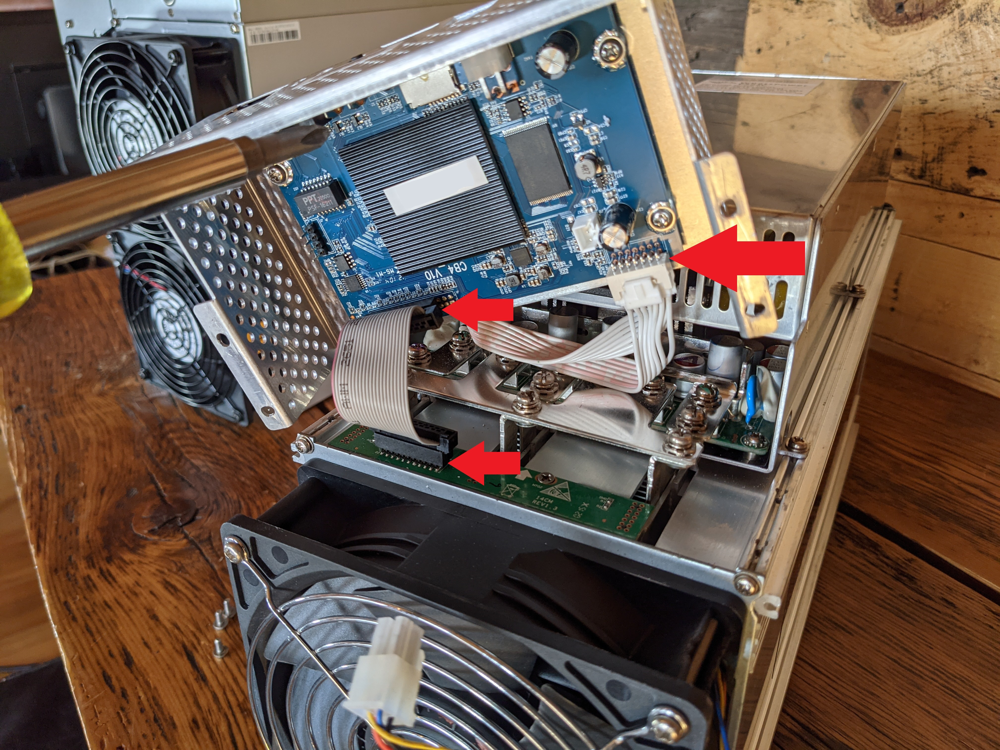
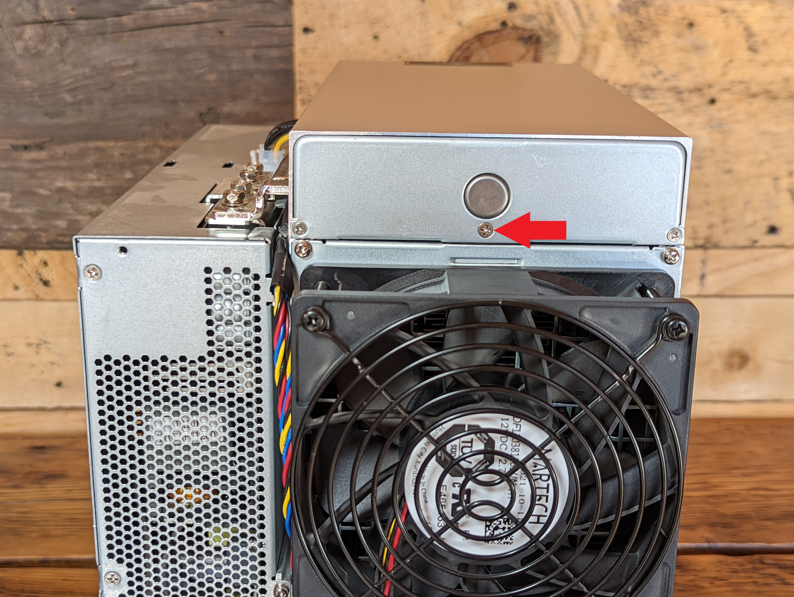
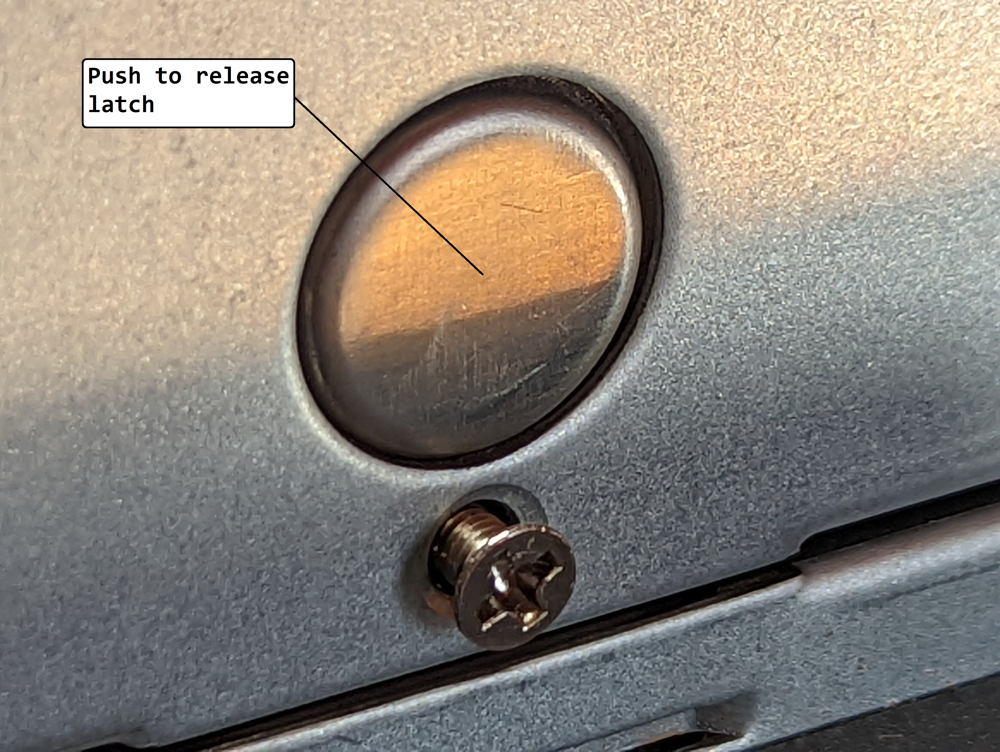
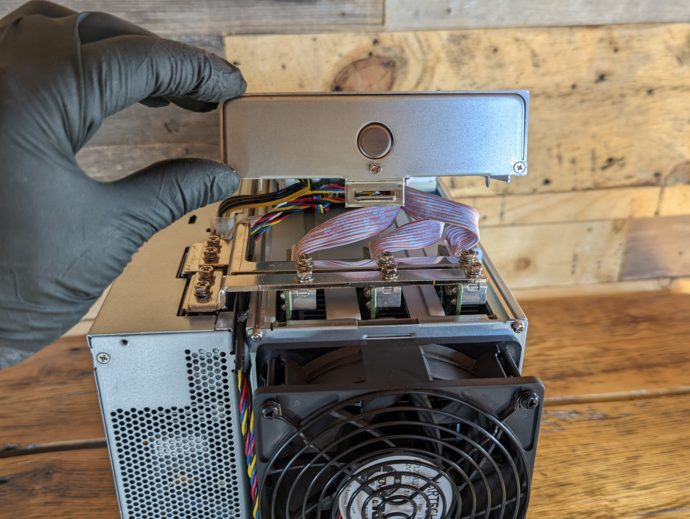
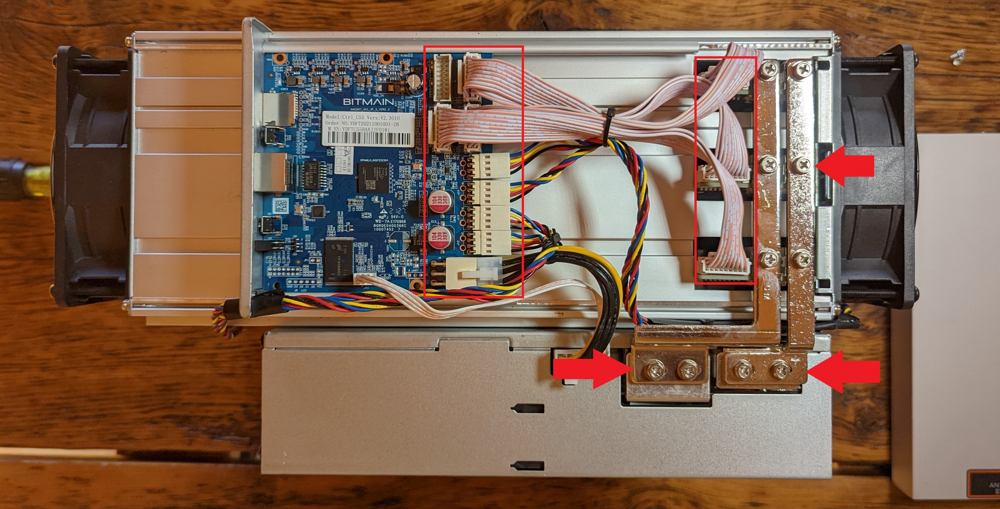
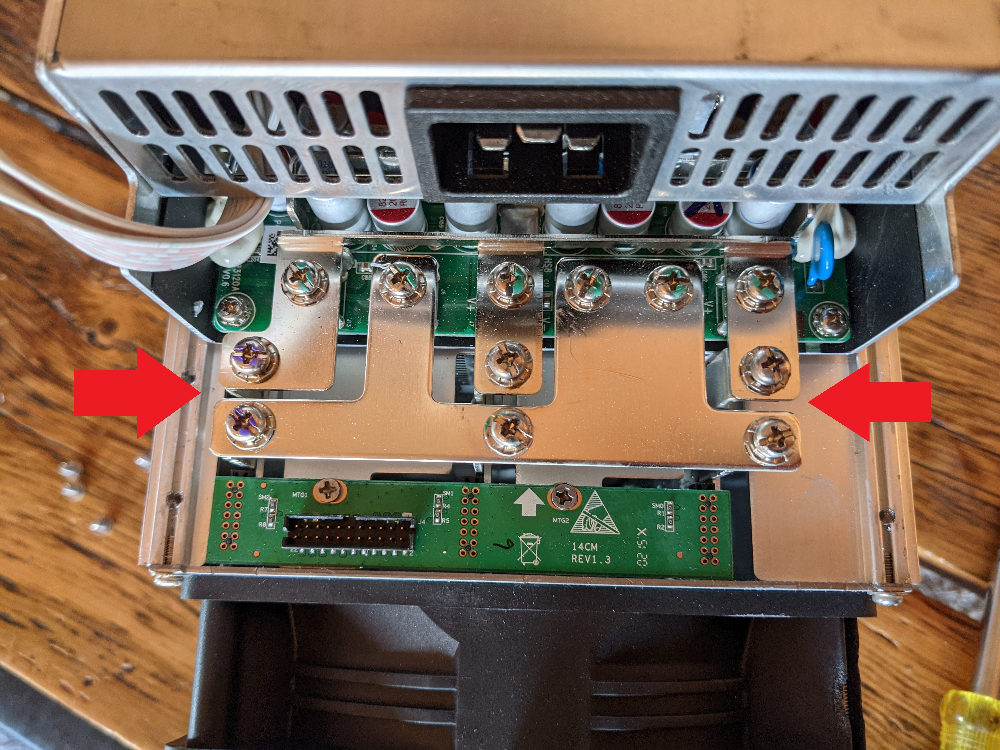
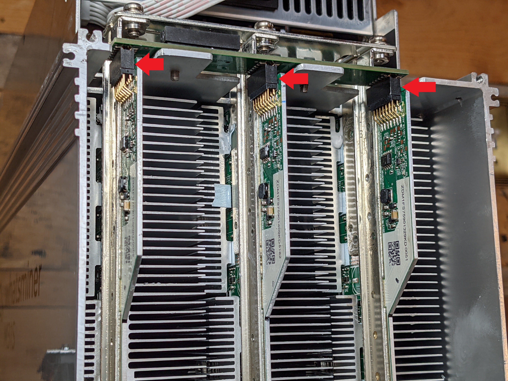

## Preliminary Checks
This is all very exciting, you have been waiting weeks for your ASIC and it is finally here. But do not rush this next part. Take a deep breath, slow down, and practice some of that low time preference Bitcoiners are known for. 

You just spent a small fortune on this hardware, it is worth your while to check a few things and ensure that nothing inside the ASIC came loose or shifted in transit. The last thing you want is to plug in your ASIC and then see smoke come out. 

Basically there are three things you want to check:

1) That the wire harness connectors are seated and tight.
 
2) That the bus bars are tight and not touching each other.

3) That the hash board connections are seated and tight. 

* On the Antminer, remove the two screws on the electrical cover on the output side of the ASIC. Then you can slide the cover off in that direction. 

* On the Whatsminer, remove the four screws on the electrical cover on the input side of the ASIC. Also disconnect the fan wire harness. 

  
  

* On the Antminer, ensure the wire harness connections under the electrical cover are seated and tight as well as the bus bars.

* On the Whatsminer, ensure the wire harness connections under the electrical cover and on the underside of the electrical cover are seated and tight. 

  
  

* On the Antminer, simply loosen the screw (without removing it all the way) directly below the round silver latch on the end of the electrical cover. Then by pressing the round silver latch, you can lift the entire cover off the top revealing the electrical components underneath. Ensure the wire harness connections are all tight and seated on the circuit board, the bus bars are tight and not touching each other, and that the hashboard connections are seated and tight.

  
  
  

* On the Whatsminer, ensure the bus bars are tight and not touching each other. Then remove the four screws attaching the intake fan to the ASIC body and ensure the hashboard connections are seated and tight. 

  
  

If you find any wire harness connectors loose, tighten them back into place. If you find that the bus bars have shifted in transit, loosen all the screws on that bus bar and realign it properly so it is not touching the other bus bars and tighten it back down. Then put everything back together the opposite of the way you took it apart. Then set your ASIC aside for now, this is a good time to get your mining pool account setup and configured prior to starting up your ASIC.

