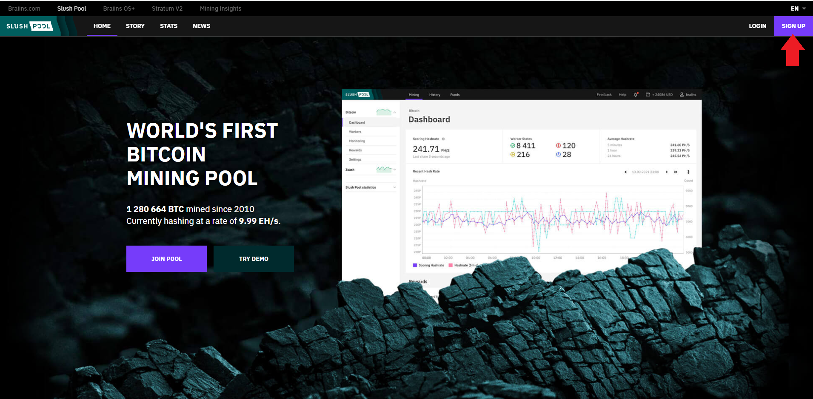
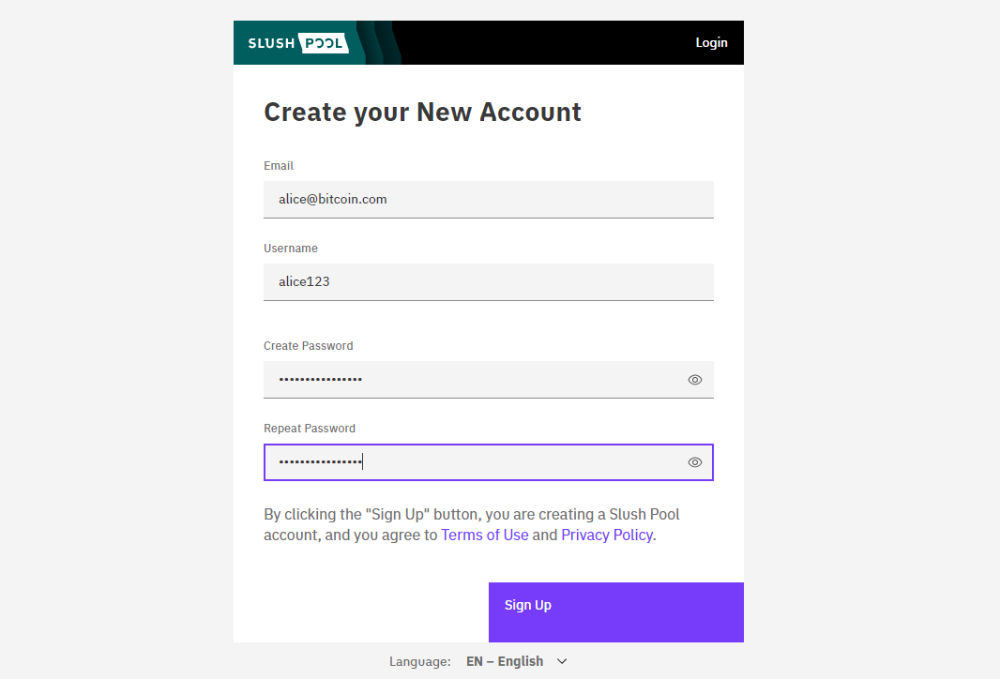
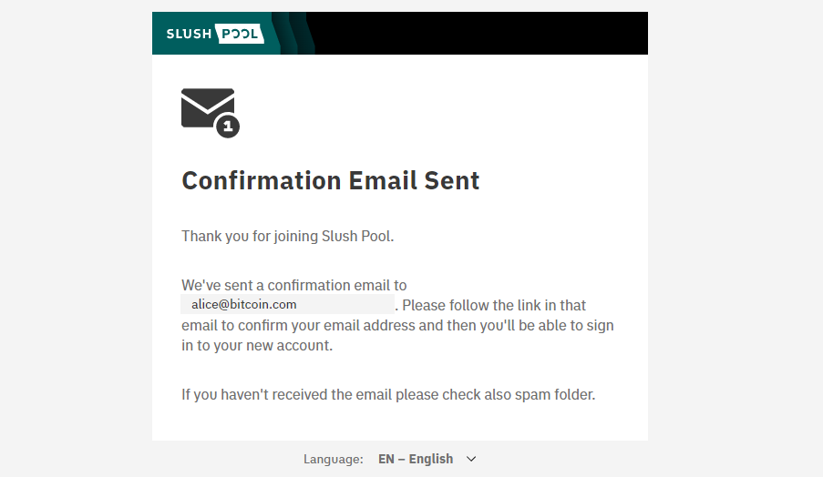
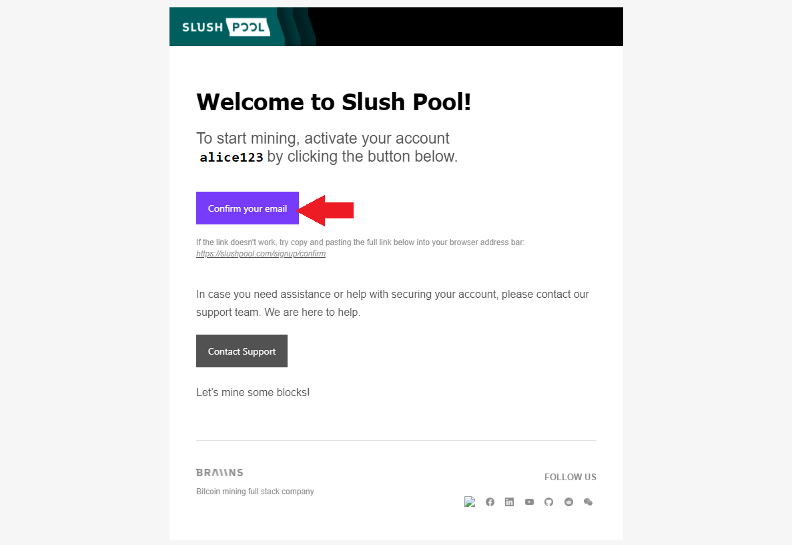
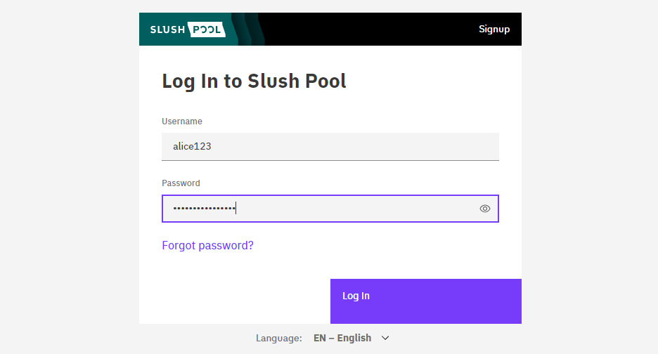
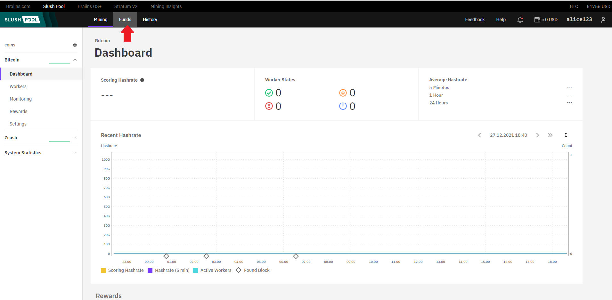
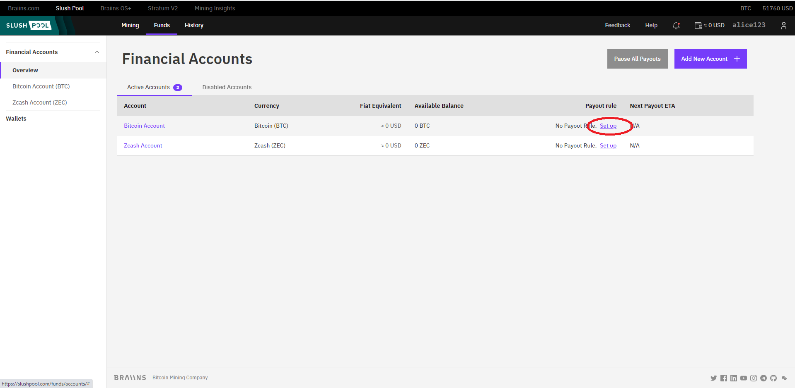
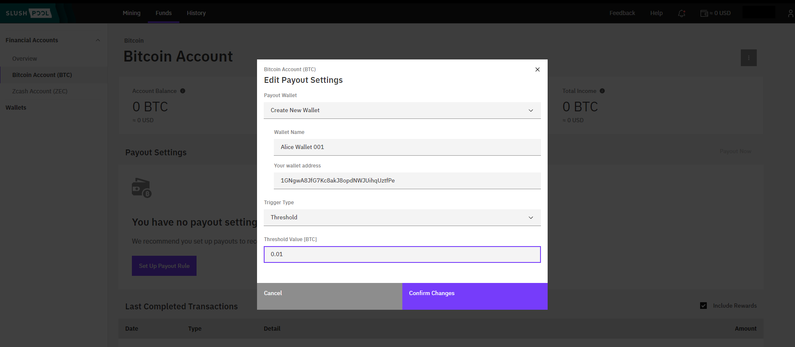

## Creating a SlushPool account
Mining solo is possible but very unlikely to yield bitcoin rewards. The chances of a solo miner solving for a block are very low and it is more likely that you will just run your ASIC indefinitely without ever solving for a block. Although, it is not impossible, as witnessed on June 3, 2020 at block height [632928](https://twitter.com/ckpooldev/status/1268334893466976257). But for most intents and purposes, you will want to connect to a mining pool so that you can maintain more steady rewards over time. With a mining pool, your rewards will be proportional to the amount of hash power you provided the pool. 

There are several different pools to choose from but the basic idea is the same with most of them. You will create an account, provide a bitcoin deposit address, and then copy/paste the mining pool URL into your ASIC configuration file so that your hash power is pointed there. Mining pools typically retain a small fee of your rewards between 1% - 3%. Then you receive rewards based on the number of blocks the pool finds and your proportional contribution to the pool during those block finds. You can learn more about mining pools [here](https://miningpools.com/bitcoin/).

In this guide, [SlushPool](https://slushpool.com/en/home/) will be covered. Some background on SlushPool is that they were the first Bitcoin mining pool, they supported small blocks during the block wars, they were the first pool to signal for taproot activation, they have a user-friendly dashboard and mobile app. Additionally, SlushPool pushes development of the [BraiinsOS](https://braiins.com/) firmware which can be used to make your Antminer perform better. BraiinsOS is not available for Whatsminers yet but will be soon. 

To get started with SlushPool, first navigate to [https://slushpool.com/en/home/](https://slushpool.com/en/home/) and click on `SIGN UP` in the upper left-hand corner. 

Then you can input an email address, username, and create a strong password. You may want to make considerations about using an email or username that do not reveal personally identifiable information about you. A confirmation email will be sent to the provided email address. 

  

Open the confirmation email that was sent to you by SlushPool and click on the confirmation link. That link will bring you to the SlushPool log in page where you can enter your username and password. You will likely be presented with a Captcha. 

  

  

After successfully logging in, you should now be looking at your new SlushPool dashboard. The first thing you want to do is setup your rewards payout. Navigate to the `Funds` tab in the upper menu bar. 

Next, navigate to the row labeled `Bitcoin Account` and on the right-hand side click on the `Set up` hyperlink. Then click on the `Create New Wallet` option. Then fill in a wallet name, your bitcoin deposit address from your preferred wallet, and select either a `Trigger Type` of `threshold` or `time interval`. With small scale mining operations it may make more sense to use the `threshold` option so that once the accumulated rewards exceed a specified threshold, the payout is made. Specifying a threshold value lower than 0.01 bitcoin will result in a small fee. Then click on `Confirm Changes`.  

You will be asked to confirm your SlushPool password and you will be sent a confirmation email asking for you to confirm the deposit address change. After clicking on the confirmation link in your email, you will be directed to a new SlushPool window and you will see that your changes have taken effect. 

That is the process for updating your payout address. There are privacy benefits to only using addresses one time, so consider updating this address between each payout. At this point your SlushPool account is all setup and ready to use. This is a good time to do the initial startup with your ASIC and then the configuration can be set to your new SlushPool account.

