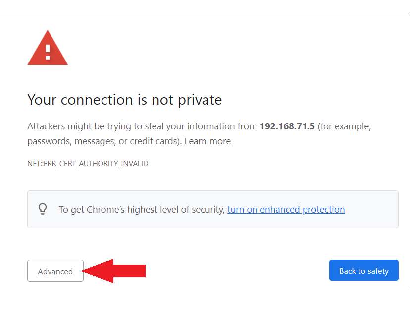
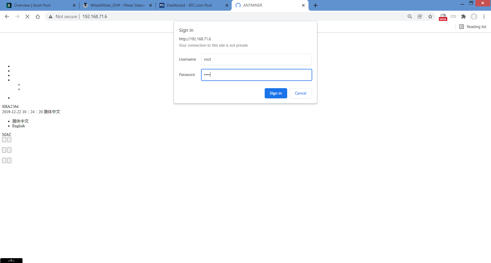
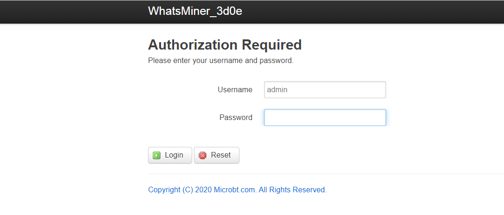

## Miner configuration
In order to configure your ASIC you will need to be able to communicate with it. The easiest way to do this is to use a web browser to log into your ASIC from a computer connected to the same local network. Once connected and logged into the ASIC you can make the necessary changes to connect to the mining pool. 

First you will need the local IP address for your ASIC. This can be found by logging into your router and checking the list of devices under the DHCP leases section. Your router should have the local IP address needed to login, along with the password on a label somewhere on the device. If not, the directions are usually pretty easy to find with an online search for your manufacturer's router. Typically, you can just type `192.168.0.1` or `192.168.1.1` or `10.0.0.1` into your web browser and that will bring you to your router login page. From there the username/password can vary depending on manufacturer but they are usually something like `admin/admin` or `admin/1234` or `admin/password`. Alternatively, programs like [AngryIP](https://angryip.org/) may be used. 

Once you have your ASIC's local IP address then you can just type that into your web browser URL bar and then you may be warned about how this is not a trusted connection. This is a self signed certificate so just accept the risk and continue. 

 
  

  

Once you are at the Antminer login page the username/password should be `root/root`. From the Whatsminer login page the username/password should be `admin/admin`.

Once logged in to the Antminer or Whatsminer web interface, a few important statistics to note are the Tera Hash, displayed as a Giga Hash Average: `GH/s` or `GHSav`. The Fan Speed: `FanX Speed` or `FanSpeedIn`/ `FanSpeedOut`. The Power Consumption in Watts: `Power` (on the Whatsminer). And the Hash Board Temperatures: `Inlet Temp`/`Outlet Temp` or `Temperature`. 

It can take several minutes to an hour for the ASIC to get up to speed and fully hashing, in the mean-time you can get started on connecting your ASIC to SlushPool. 

