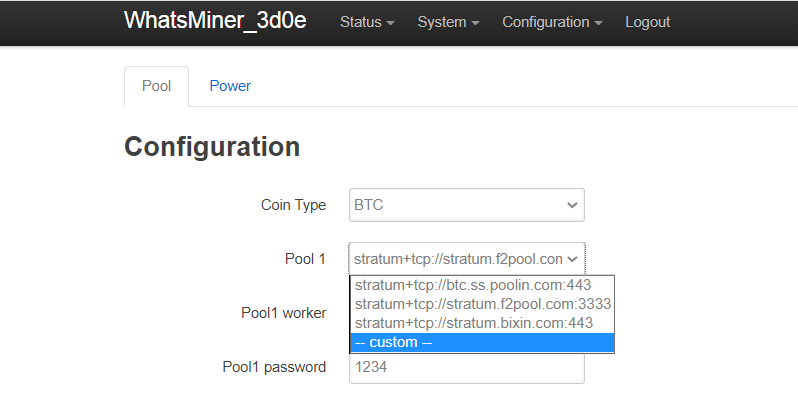
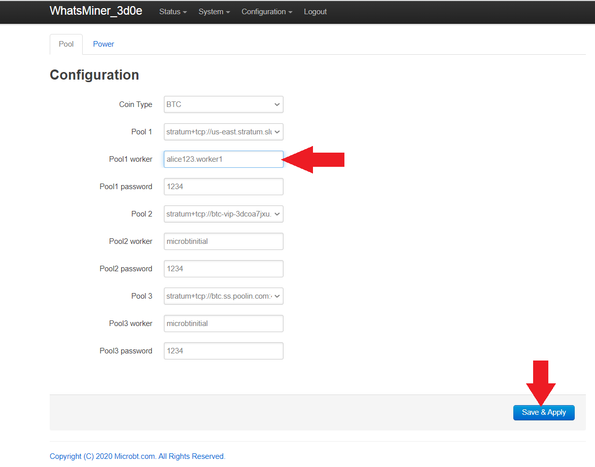
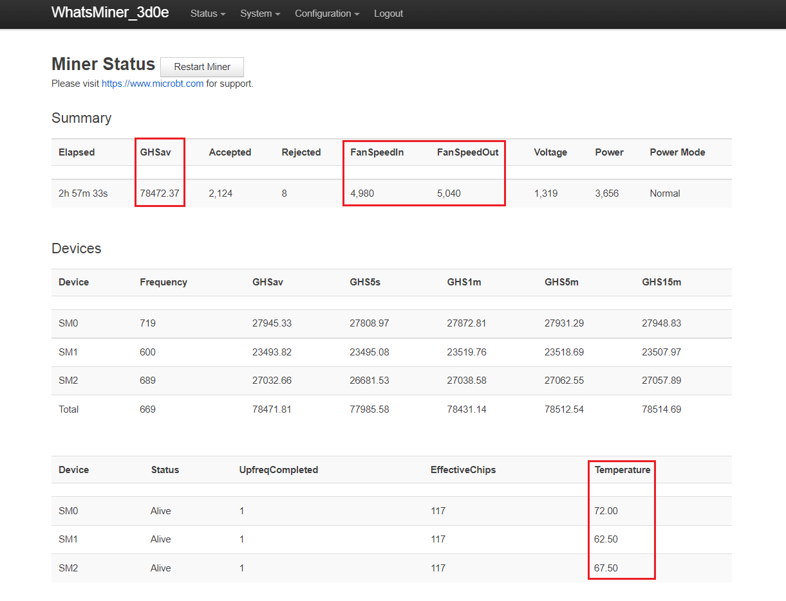

## Connecting to SlushPool
In this section you will see how to connect to SlushPool. There are many mining pools to choose from and the basic concepts covered here should be roughly the same for any pool you choose. 

## Antminer
In the Antminer web interface, navigate to `Settings` in the left-hand menu, this will bring you to the configuration page where you can add the pool URLs. 

## Whatsminer
In the Whatsminer web interface, from the top bar menu, select `Configuration` > `Miner Configuration`. This will bring you to the configuration page where the pool URLs can be added. 

## Antminer
In the Antminer configuration page, you can change all the variables and then click on `Save` at the end prior to reboot. 

## Whatsminer
In the Whatsminer configuration page it is important to click on <kbd>Save & Apply</kbd> in between each change you make. Then at the end, after all the changes have been made, the ASIC gets a reboot and the changes are applied. If you don't click <kbd>Save & Apply</kbd> between each change then those changes will be lost prior to the reboot. 

## Antminer & Whatsminer
In another tab on your web browser, log into your SlushPool account if you haven't already. Then navigate to the `Workers` tab in the left-hand side menu and click on `Connect Workers +`.

This will bring up a page where you can choose the SlushPool server that is closest to your geographic location. Choosing a server that is far from you can introduce latency which reduces mining rewards. For the Whatsminers, make sure you have `Stratum V1` selected. Only use `Stratum V2` if you have done the BraiinsOS firmware upgrade on your Antminer. You will also notice that SlushPool suggests that you name your ASIC `username.worker1` in your ASIC configuration page. So in this example, the SlushPool username is `alice123` therefore the ASIC configuration will be setup so that the ASIC is named `alice123.worker1`. If you are running multiple ASICs then just keep appending the "worker" flag sequentially. For example, `alice123.worker1` for the first ASIC. Then `alice123.worker2` in the second ASIC's configuration page, and so on. 

Also of note is that the password in the configuration page can be anything such as `1234`, there is no security precaution with this password, it is used as a way to prevent the mining pool servers from getting spammed. 

## Antminer
Copy/paste the first nearest SlushPool server into your ASIC configuration page by navigating to the `Pool 1` dialog box and placing the SlushPool URL there. 

## Whatsminer
Copy/paste the first nearest SlushPool server into your ASIC configuration file by navigating to the `Pool 1` drop down menu and selecting `-- Custom --` and then pasting the SlushPool URL there. Then click on `Save & Apply` before making any other changes. 

  
  

## Antminer
Name your ASIC using your SlushPool username followed by `.worker1` for example, `alice123.worker1`. 

## Whatsminer
Name your ASIC using your SlushPool username followed by `.worker1` for example, `alice123.worker1`. Then click on `Save & Apply` before making any other changes. 

## Antminer
You can use any password such as `1234`. Then click on `Save`.

## Whatsminer
You can leave the default password as `1234`.

## Antminer & Whatsminer
Repeat this process for the other two failover servers, picking a different server for each. Keep the worker name and password the same for each. Make sure you save your setting changes prior to reboot.  

## Antminer
The ASIC needs to be rebooted in order for these changes to take effect. Click on <kbd>Restart Miner</kbd> in the lower right-hand corner, then again in the pop-up promt. You should hear the fans spool down and back up again.

## Whatsminer
The ASIC needs to be rebooted in order for these changes to take effect. Navigate to `System` > `Reboot` then click on the <kbd>Perform reboot</kbd> button. You will be logged out of the interface and the ASIC will reboot. You will hear the fans spool up and down a couple times. Then you can log back into the ASIC interface. 

  
  

  

## Antminer & Whatsminer
After a few minutes and as long as 90 minutes, you should start to see activity showing up in your SlushPool dashboard. Do not be alarmed if the hash rate is low or if the worker is showing as `Offline` or `Disabled`, it can take a long time for everything to connect and settle down. 

At this point, simply monitor both your SlushPool dashboard and the ASIC web interface to ensure that the amount of hash being generated at the interface is reaching the dashboard. 

Keep in mind that the prominently displayed hash rate score on the SlushPool interface is your scoring rate which is made of averages. During initial startup do not be surprised if this number is significantly lower than the hash rate reading you get from the web interface on your ASIC. A more accurate metric to watch is in the upper right-hand corner of your SlushPool dashboard, the `5 minute`, `1 hour`, and `24 hour` averages. 
