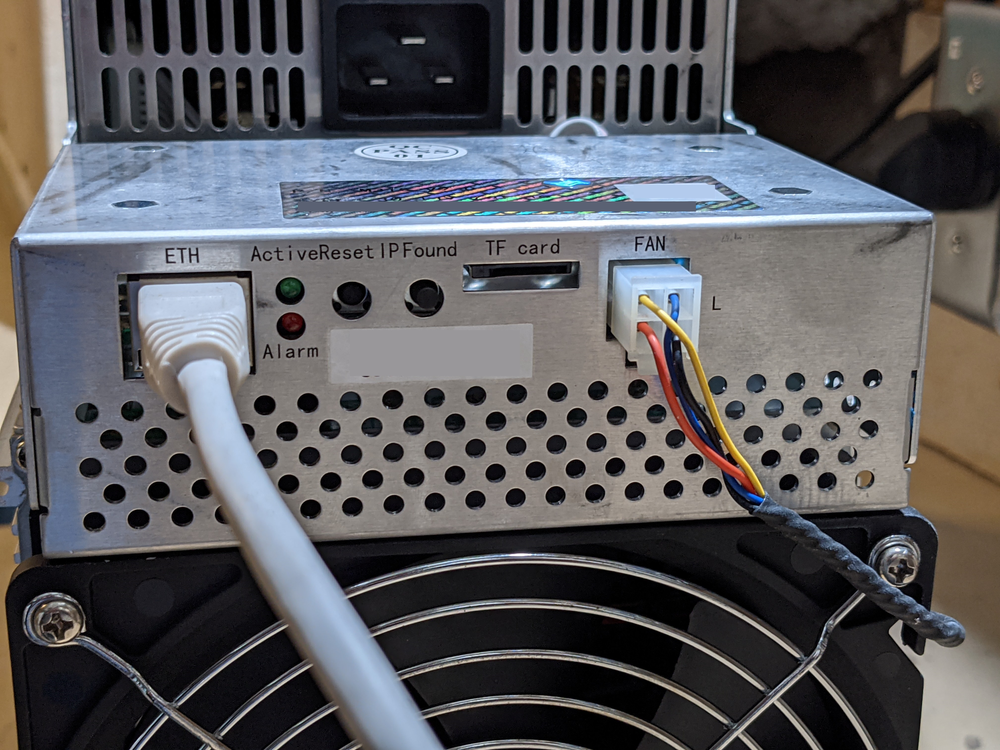
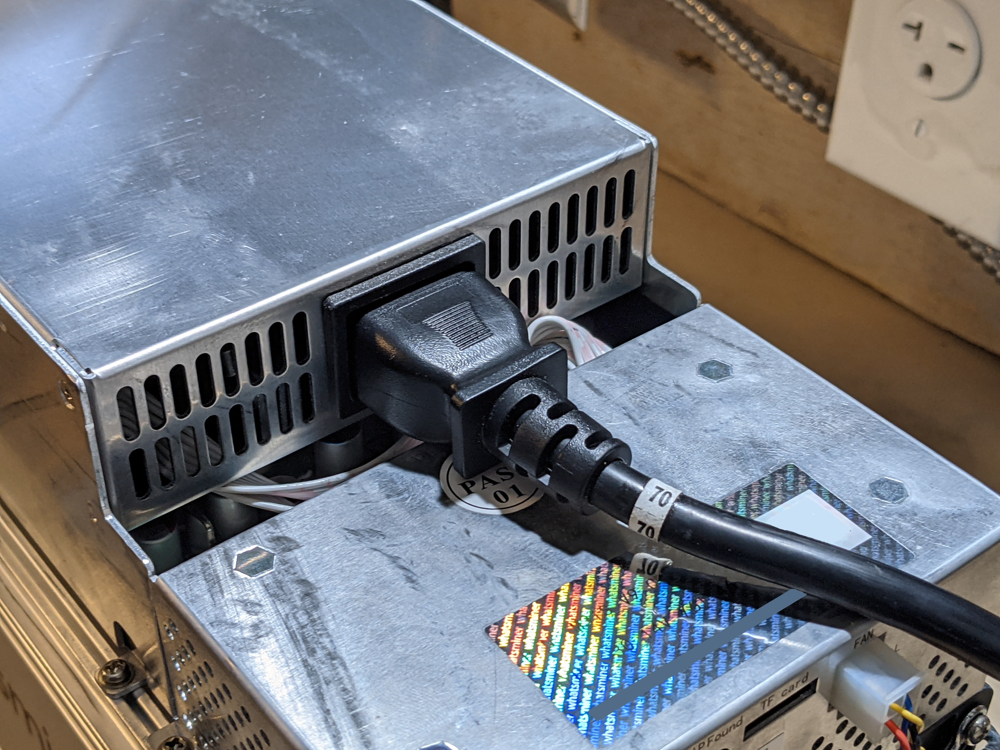
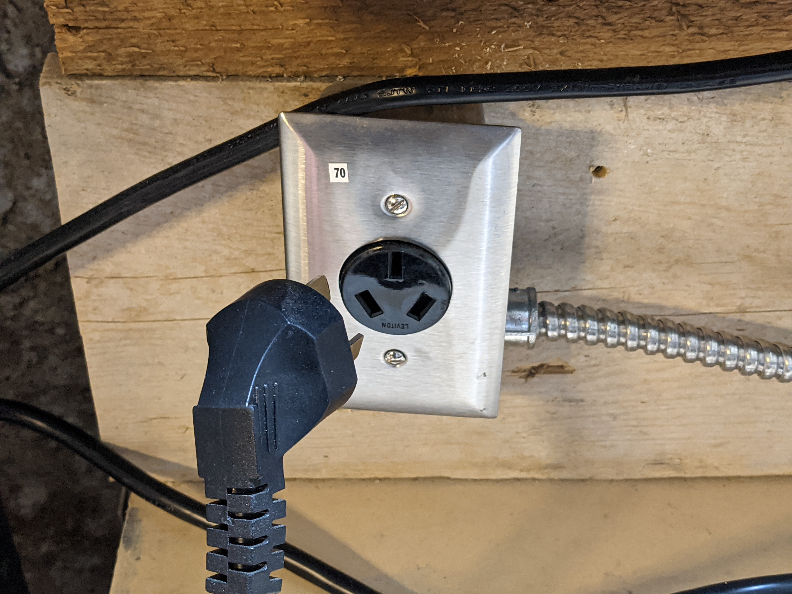
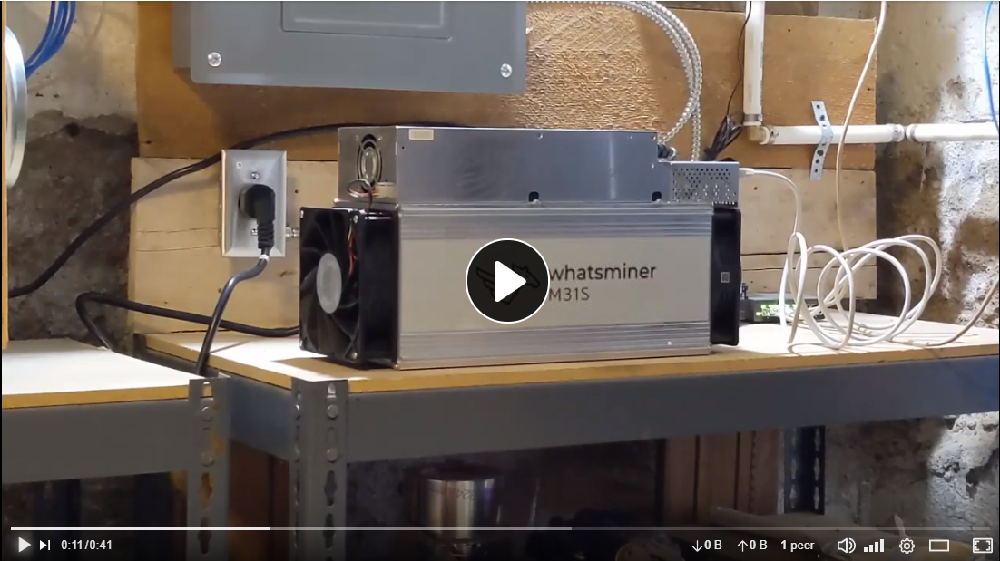

## Initial Startup
As soon as you plug the ASIC into power it will start running. There is no on or off switch. So long as it has power it will run. During the initial start up you want pay attention to the air flow of the fans on your ASIC as soon as you start it up. If one of the fans are installed backwards then you want to immediately unplug the ASIC and fix that before proceeding. Keep your fingers away from moving fan blades. 

Make sure the Ethernet connections and power cable connections are seated and tight.

1) Plug in an Ethernet cable to the back of the ASIC and connect the other end to your router or switch.
 
2) Plug the power cable in to the back of the ASIC then connect the other end to the outlet.

3) Ensure the air flow is moving the right direction. 

If you hear any rattling sounds or smell something burning immediately unplug the ASIC. 

 
  
   

Once the ASIC is running then the initial miner configurations can be made. To power down the ASIC, unplug the Ethernet cable and wait a few minutes for the ASIC to go into standby mode where it will spool down the fans to a low idle. Then wait a few more minutes for the hashboarsds to cool off and then unplug the power cable.  

