## Miner configuration
In order to configure your ASIC you will need to be able to communicate with it. The easiest way to do this is to use a web browser to log into your ASIC from a computer connected to the same local network. Once connected and logged into the ASIC you can make the necessary changes to connect to the mining pool. 

First you will need the local IP address for your ASIC. This can be found by logging into your router and checking the list of devices under the DHCP leases section. Your router should have the local IP address needed to log into it along with the password on a label somewhere on the device. If not, the directions are usually pretty easy to find with an online search for your manufacturers router. Typically, you can just type `192.168.0.1` or `192.168.1.1` or `10.0.0.1` into your web browser and that will bring you to your router login page. From there the username/password can vary depending on manufacturer but they are usually something like `admin/admin` or `admin/1234` or `admin/password`. Alternatively, programs like [AngryIP](https://angryip.org/) may be used. 

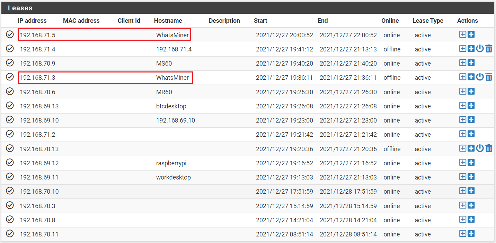

Once you have your ASIC's local IP address then you can just type that into your web browser URL bar and then you may be warned about how this is not a trusted connection. This is a self signed certificate so just accept the risk and continue. 

 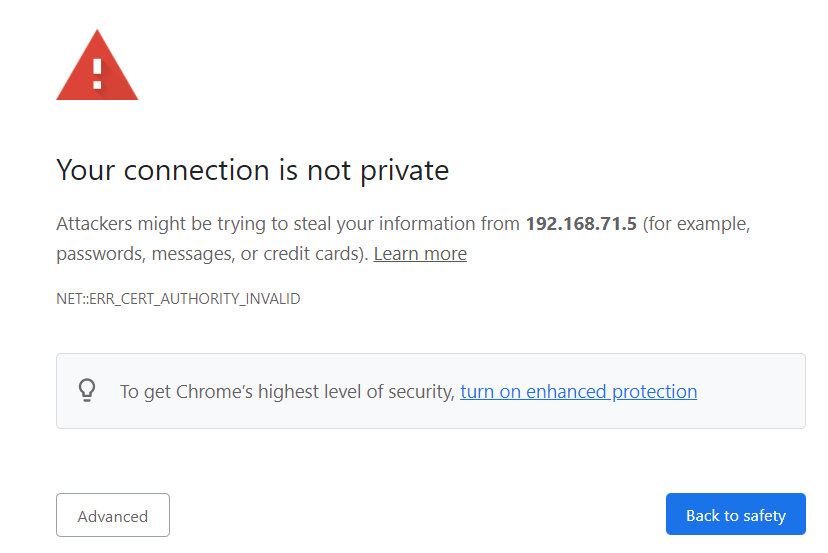
  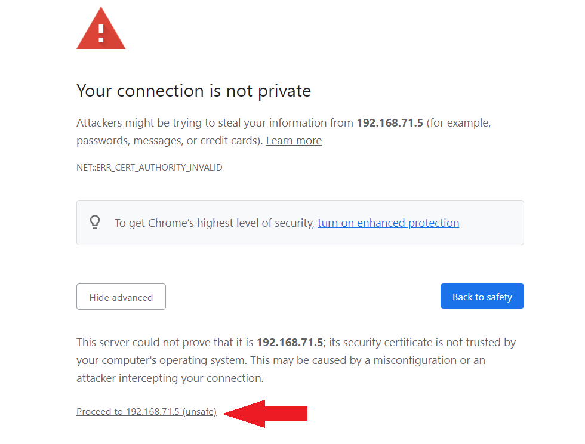

  

Once you are at the Antminer login page the username/password should be `root/root`. From the Whatsminer login page the username/password should be `admin/admin`.

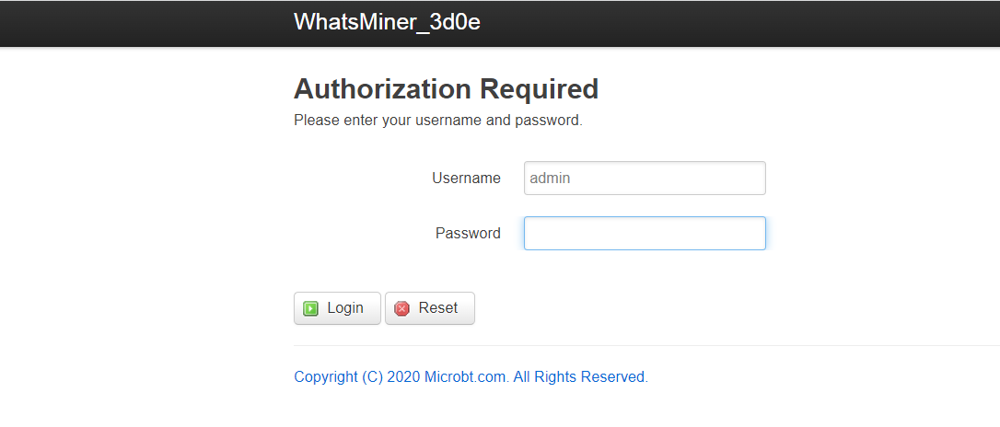

Once logged in to the Whatsminer, a few important statistics to note are the Giga Hash Average: `GHSav`, the Intake Fan Speed: `FanSpeedIn`, the Exhaust Fan Speed: `FanSpeedOut`, the Power Consumption in Watts: `Power`, and the Hash Board Temperatures: `Temperature`. 

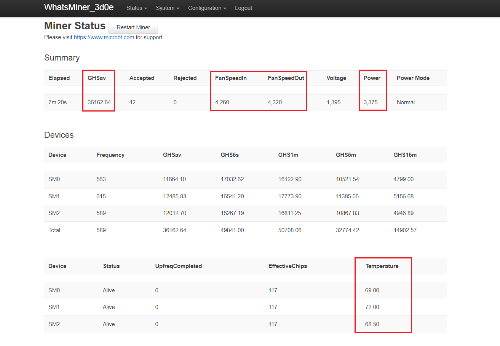

It can take several minutes to an hour for the ASIC to get up to speed and fully hashing, in the mean-time you can get started on connecting your ASIC to SlushPool. 

## Connecting to SlushPool
In the Whatsminer configuration page, you will be able to link three mining pools. Only one can be used at a time but the other two are there as failovers in case a mining pool server goes down. The username you use for your "worker" (your ASIC) should be the same as your SlushPool username.

Navigate to `Configuration` > `Miner Configuration`

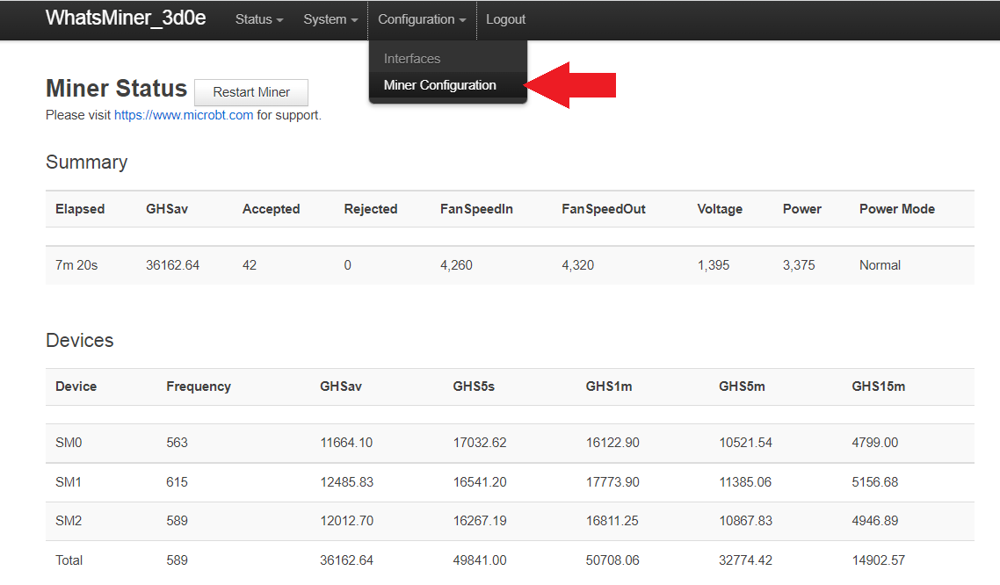

Next, this is the page where you will make your mining pool and username configurations. In the Whatsminer configuration page it is important to click on <kbd>Save & Apply</kbd> in between each change you make. Then at the end after all the changes have been made, the ASIC gets a reboot and the changes are applied. 

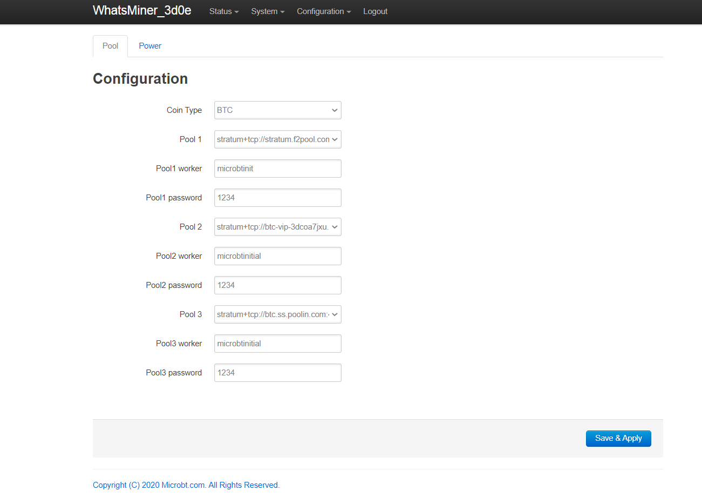

In another tab, log into your SlushPool account if you haven't already. Then navigate to the `Workers` tab in the left-hand side menu and click on `Connect Workers +`.

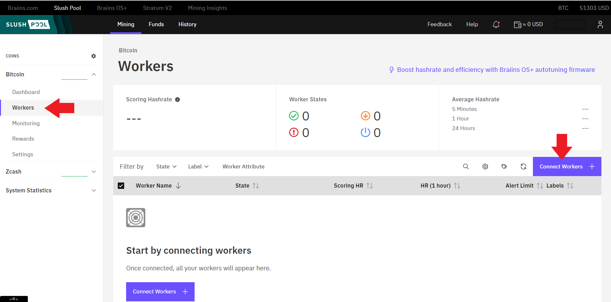

This will bring up a page where you can choose the SlushPool server that is closest to your geographic location. Choosing a server that is far from you can introduce latency which reduces mining rewards. For the Whatsminers, make sure you have `Stratum V1` selected. Only use `Stratum V2` if you have done the BraiinsOS firmware upgrade on your Antminer. You will also notice that SlushPool suggests that you name your ASIC `username.worker1` in your ASIC configuration page. So in this example, the SlushPool username is `alice123` therefore the ASIC configuration will be setup so that the ASIC is named `alice123.worker1`. Also of note is that the password in the configuration page can be anything such as `1234`, there is no security precaution with this password, it is used as a way to prevent the mining pool servers from getting spammed. 

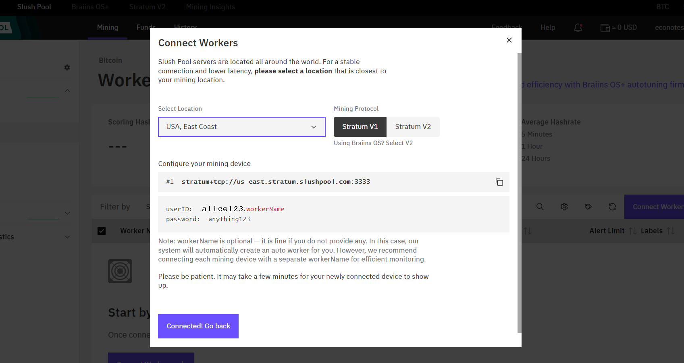

Copy/paste the first nearest SlushPool server into your ASIC configuration file by navigating to the `Pool 1` drop down menu and selecting `-- Custom --` and then pasting the SlushPool URL there. Then click on `Save & Apply` before making any other changes. 

 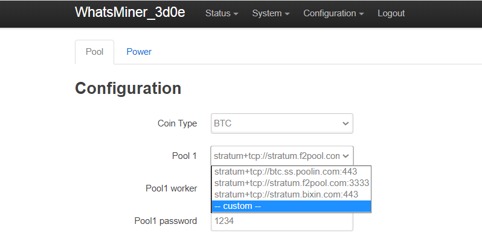
  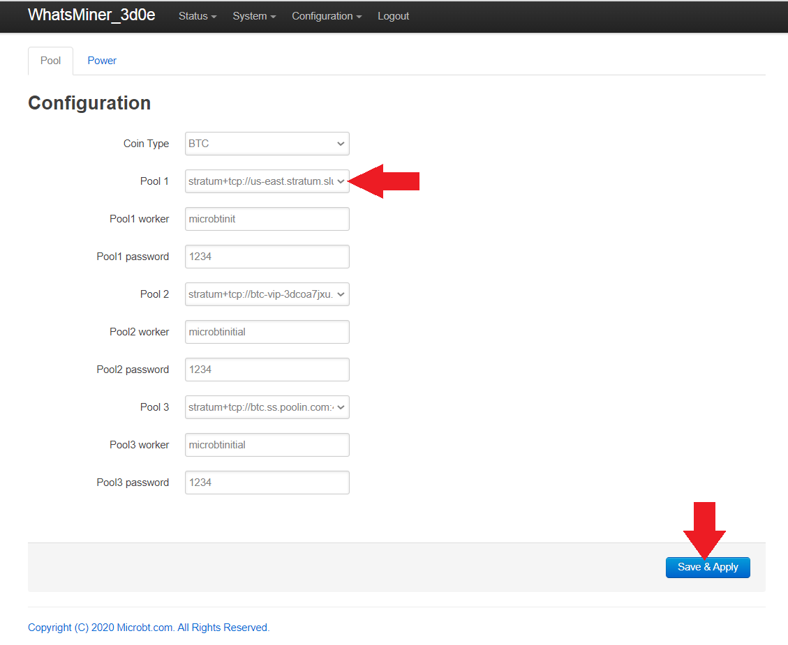

 

Next, name your ASIC using your SlushPool username followed by `.worker1` for example, `alice123.worker1`. Then click on `Save & Apply` before making any other changes. 

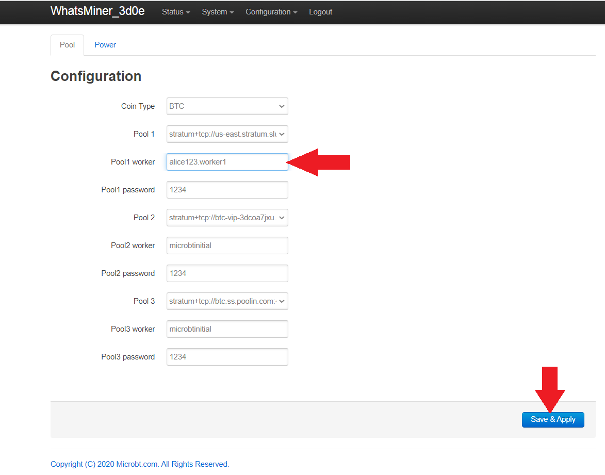

Repeat this process for the other two failover servers, picking a different server for each. Keep the worker name and password the same for each. 

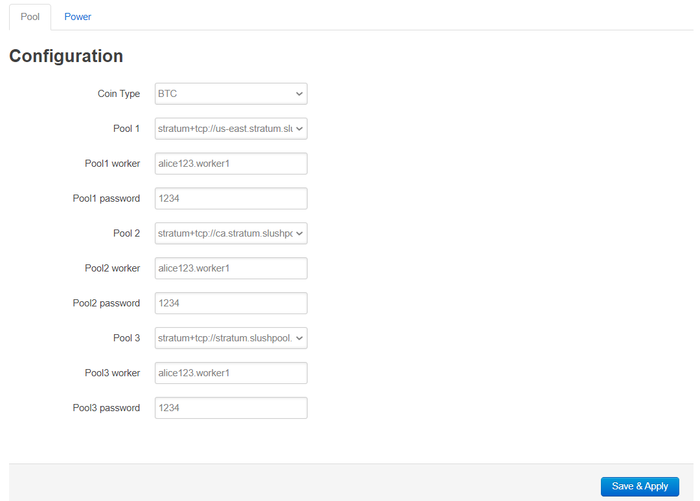

The ASIC needs to be rebooted in order for these changes to take effect. Navigate to `System` > `Reboot` then click on the <kbd>Perform reboot</kbd> button. You will be logged out of the interface and the ASIC will reboot. You will hear the fans spool up and down a couple times. Then you can log back into the ASIC interface. 

 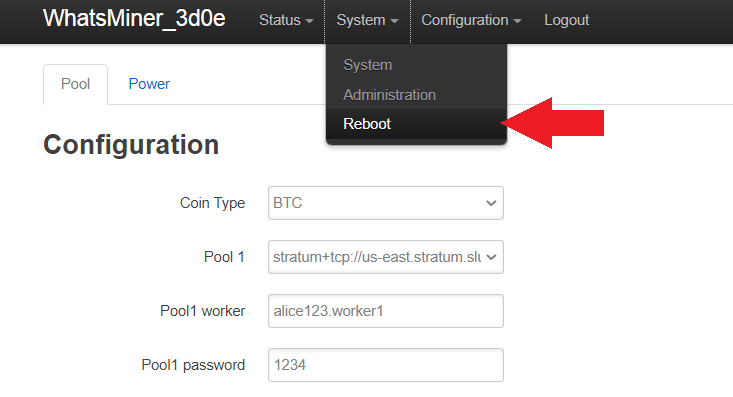
  

 

After a few minutes and as long as 90 minutes, you should start to see activity showing up in your SlushPool dashboard. Do not be alarmed if the hash rate is low or if the worker is showing as `Offline` or `Disabled`, it can take a long time for everything to connect and settle down. 

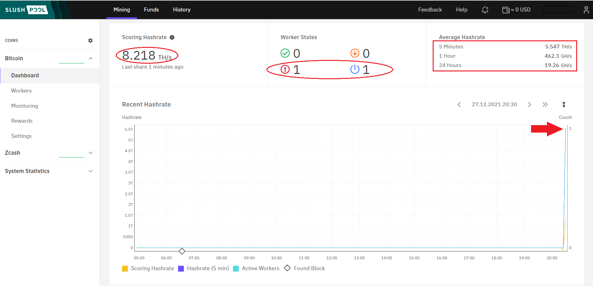

At this point, simply monitor both your SlushPool dashboard and the ASIC web interface to ensure that the amount of hash being generated at the interface is reaching the dashboard. 

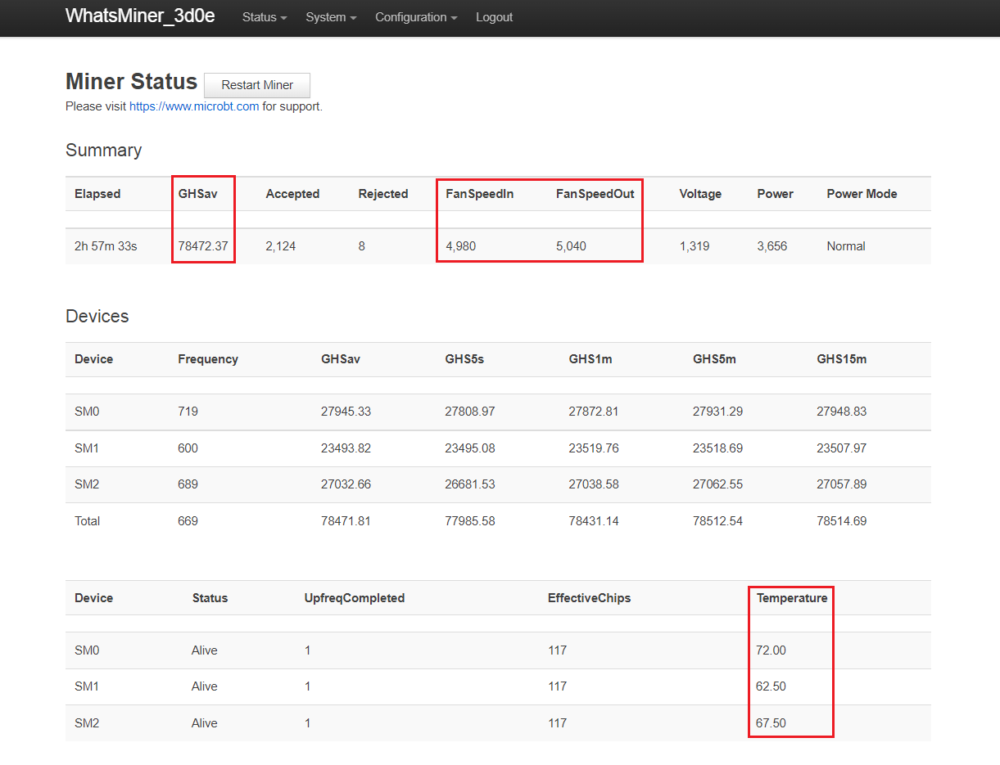

Keep in mind that the prominently displayed hash rate score on the SlushPool interface is your scoring rate which is made of averages. During initial startup do not be surprised if this number is significantly lower than the hash rate reading you get from the web interface on your ASIC. A more accurate metric to watch is in the upper right-hand corner of your SlushPool dashboard, the `5 minute`, `1 hour`, and `24 hour` averages. 

## Setting up the BlackBox (coming soon™)

## DIY BlackBox instructions (coming soon™) 

## Advanced Topics: Mining with a VPN & Test Networks/Firmware (coming soon™)
