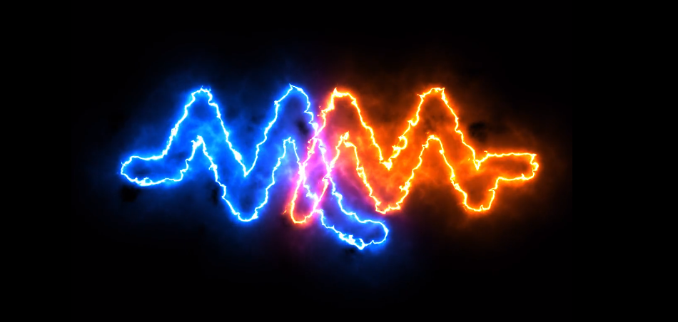

# UpstreamData Startup Instructions for Whatsminer M30S & Antminer S19 Pro
Congratulations on starting your Bitcoin mining journey with Upstream Data! Please take a few minutes to read this guide for helpful tips & tricks to get you started on the right foot. If you have any questions, feel free to reach out in the [Upstream Data Customer Support Telegram channel](https://t.me/OhmmMiningSupport). This guide is meant as referrence material for Upstream Data BlackBox Bundle customers who are receiving their ASICs now with an expected delivery of their BlackBox in the near future. You should be getting either a Whatsminer M30S+ or Antminer S19 Pro, those are the only ASICs referrenced here. 

  

  

This guide will cover these topics:
- Basic electrical requirements
- Unboxing 
- Priliminary checks
- Initial startup
- Creating a SlushPool account
- Miner configuration
- Connecting to SlushPool
- Setting up the BlackBox (coming soon)

## Basic Electrical Requirements
Electrical is no joke, hundreds of people across North America die each year from electrocution. Safety standards are there for a reason and you need to consult with a licensed electrician to ensure your installation meets the minimum safety requirements. Hiring a licensed electrician is not as expensive as you might think. You just spent upwards of $10,000 on your ASIC, the last thing you want to do is fry it; or worse cause damage to your home, your loved ones, or yourself. 

The information provided here is refrrence material only. This information is provided to give you a basic understanding of the materials involved and how they are configured so that you can have a well-informed discussion with your licensed electrician and forecast your budget better. The information provided here is not meant as Do-It-Yourself (DIY) instructions. 

Understanding the electrical infrastructure starts with understanding your Bitcoin mining hardware. The links lead to the manufacturer's specification pages for more details. 

[Whatsminer M30S+](https://whatsminer.com/mall/parts/38.html)
Power Supply Unit: P21E 
Operating Voltage: 200 volts to 277 volts (240 volt)
Wattage: 3,400 Watts
Amperage: ~15 amps

[Antminer S19 Pro](https://support.bitmain.com/hc/en-us/articles/900000261726-S19-Pro-Specifications)
Power Supply Units: APW121215
Voltage: 200 volts to 240 volts (240 volt)
Wattage: 3,250 Watts
Amperage: ~14 amps

To calculate amps take the wattage divided by the voltage, for example: `3,400 ÷ 240 = 15 amps`

With this basic information, we can start to understand the minimum requirements of the electrical infrastructure. One important concept here is the 80% rule. In electrical circuits with a continuous load such as an ASIC that runs 24/7, the consumption should never exceed 80% of the circuit capacity.

Observing the 80% rule, to calculate what the circuit should be rated for, multiply the amperage by 1.25, for example: `15 x 1.25 = 18.75` which should be rounded up to the nearest standard, 20 amps in this case.

Whether you have a Whatsminer or an Antminer, you will want to have a circuit that is rated for at least 20 amps. This means you will wants a 240 volt, 20 amp circuit breaker available in your electrical panel. From there you will want to run at least 14 AWG THHN/THWN 90° cable to the outlet. Then you will want outlets that are also rated for 20 amps, 240 volts such as Nema [6-20 recepticles](https://www.mcmaster.com/7120K88/). Here is an example of some common materials that meet these specifications:

  

