# UpstreamData Startup Instructions for Whatsminer M30S & Antminer S19 Pro
Congratulations on starting your Bitcoin mining journey with Upstream Data! Please take a few minutes to read this guide for helpful tips & tricks to get you started on the right foot. If you have any questions, feel free to reach out in the [Upstream Data Customer Support Telegram channel](https://t.me/OhmmMiningSupport). This guide is meant as reference material for Upstream Data BlackBox Bundle customers who are receiving their ASICs now with an expected delivery of their BlackBox in the near future. You should be getting either a Whatsminer M30S+ or Antminer S19 Pro, those are the only ASICs referenced here. 

This guide will cover these topics:
- Basic electrical requirements
- Unboxing 
- Preliminary checks
- Creating a SlushPool account
- Initial startup
- Miner configuration
- Connecting to SlushPool
- Setting up the BlackBox (coming soon)
- DIY BlackBox instructions (coming soon) 
- Advanced Topics: Mining with a VPN & Test Networks/Firmware (coming soon)

## Basic Electrical Requirements
Electrical is no joke, hundreds of people across North America die each year from electrocution. Safety standards are there for a reason and you need to consult with a licensed electrician to ensure your installation meets the minimum safety requirements. Hiring a licensed electrician is not as expensive as you might think. You just spent upwards of $10,000 on your ASIC, the last thing you want to do is fry it; or worse cause damage to your home, your loved ones, or yourself. 

The information provided here is reference material only. This information is provided to give you a basic understanding of the materials involved and how they are configured so that you can have a well-informed discussion with your licensed electrician and forecast your budget better. The information provided here is not meant as Do-It-Yourself (DIY) instructions. 

Understanding the electrical infrastructure starts with understanding your Bitcoin mining hardware. The links lead to the manufacturer's specification pages for more details. 

[Whatsminer M30S+](https://whatsminer.com/mall/parts/38.html)
- Power Supply Unit: P21E 
- Operating Voltage: 200 volts to 277 volts (240 volt)
- Wattage: 3,400 Watts
- Amperage: ~15 amps

[Antminer S19 Pro](https://support.bitmain.com/hc/en-us/articles/900000261726-S19-Pro-Specifications)
- Power Supply Units: APW121215
- Voltage: 200 volts to 240 volts (240 volt)
- Wattage: 3,250 Watts
- Amperage: ~14 amps

To calculate amps take the wattage divided by the voltage, for example: `3,400 ÷ 240 = 15 amps`

With this basic information, we can start to understand the minimum requirements of the electrical infrastructure. One important concept here is the 80% rule. In electrical circuits with a continuous load such as an ASIC that runs 24/7, the consumption should never exceed 80% of the circuit capacity.

Observing the 80% rule, to calculate what the circuit should be rated for, multiply the amperage by 1.25, for example: `15 x 1.25 = 18.75` which should be rounded up to the nearest standard, 20 amps in this case.

Whether you have a Whatsminer or an Antminer, you will want to have a circuit that is rated for at least 20 amps. This means you will want a 240 volt, 20 amp circuit breaker, 20 amp outlets, and 12 gauge cable. Here is an example of some common materials that meet these specifications:

Let's break down what we see in this picture and why:
* [Nema 6-20 Outlets](https://www.mcmaster.com/7120K88/), rated for 250 volts, 20 amps, commonly available Nema specification for power cables.
* [HOM Style 20A 240V Circuit Breaker](https://www.mcmaster.com/69225K4-69225K75/), for Square D brand panels. If you have a Siemens brand panel, you want the [QP style breaker](https://www.mcmaster.com/5259T5-5259T52/). Or if you have a Cutler-Hammer brand panel, you want the [CH style breaker](https://www.mcmaster.com/5259T8-5259T82/).
* [12/2 MC Cable](https://www.mcmaster.com/6730T24-6730T243/), rated for 600 volts, 20 Amps, 12 AWG THHN 90° cable, metal jacket means it can be ran on the exterior of walls and still meets code.
* [MC Cable Connectors](https://www.mcmaster.com/7969K21/), easily terminate the MC cable to the electrical panel and outlet box 1/2" knockouts.   
* [Outlet Box](https://www.mcmaster.com/71695K21/), robust steel construction, 10x 1/2" knockouts for a variety of configurations. 
* [Wall Plate](https://www.mcmaster.com/8033K81-8033K13/) "unbreakable" Nylon construction, looks clean once installed. 

For a Whatsminer, you only need one outlet. But for the Antminer, you need two outlets because it has two power supplies. Now don't let this get you all confused, the whole ASIC still only consumes ~14 amps, each power supply is pulling ~7 amps. Also, both outlets can be installed on the same 20 amp circuit like I have demonstrated here:

Your ASIC will most likely not include a power cable, the Whatsminers need a C19 connection and the Antiminers need a C13 connection. If you installed 6-20 outlets then these are the power cables you want:

1 x [C19 to 6-20 cable for a Whatsminer](https://www.amazon.com/NEMA-6-20P-Power-Cord-IBX-4937-01-C/dp/B07BZS7VQG/ref=sr_1_1_sspa?crid=217EW29IF29BN&keywords=nema%2B6-20p%2Bto%2Bc19%2Bpower%2Bcord&qid=1640238622&s=electronics&sprefix=nema%2B%2Celectronics%2C164&sr=1-1-spons&spLa=ZW5jcnlwdGVkUXVhbGlmaWVyPUFOUzUxMVpWRFEwTUcmZW5jcnlwdGVkSWQ9QTA2MDIxMDMzMlZNWUZIUzhTMVVCJmVuY3J5cHRlZEFkSWQ9QTA5ODMzMjlJSTgxMUhLSUFaTTUmd2lkZ2V0TmFtZT1zcF9hdGYmYWN0aW9uPWNsaWNrUmVkaXJlY3QmZG9Ob3RMb2dDbGljaz10cnVl&th=1)

2 x [C13 to 6-15 cable for a Antminer](https://www.amazon.com/NEMA-6-15P-Power-Cord-IBX-4933-06-C/dp/B07DGM3NXY?th=1) (the 6-15 fits in the 6-20 outlet, C13 specifications do not exceed 15 amps)

If you are lucky, your Whatsminer might come with a Nema 10-20 to C19 power cable. If that is the case and you want to use that included power cable, then you will want to use the [10-20 outlet](https://www.mcmaster.com/7120K95/). 

That should give you a basic understanding of your electrical requirements to discuss with your licensed electrician. Now you should be ready to open your ASIC and check a few things before powering it on. 

## Unboxing
Here is what you can expect upon receiving your ASIC. The Antminer will be shipped in a box that reads "Antminer" on the side and has the word "Bitmain" printed on the packing tape. Not great for opsec so be prepared for that. The Whatsminer ships in a plain box with only a small holographic sticker on it with any indication of the contents.

The Antminer box measures 22"L x 17"H x 13"W. The Whatsminer box measures 21"L x 14"H x 9"W. 

  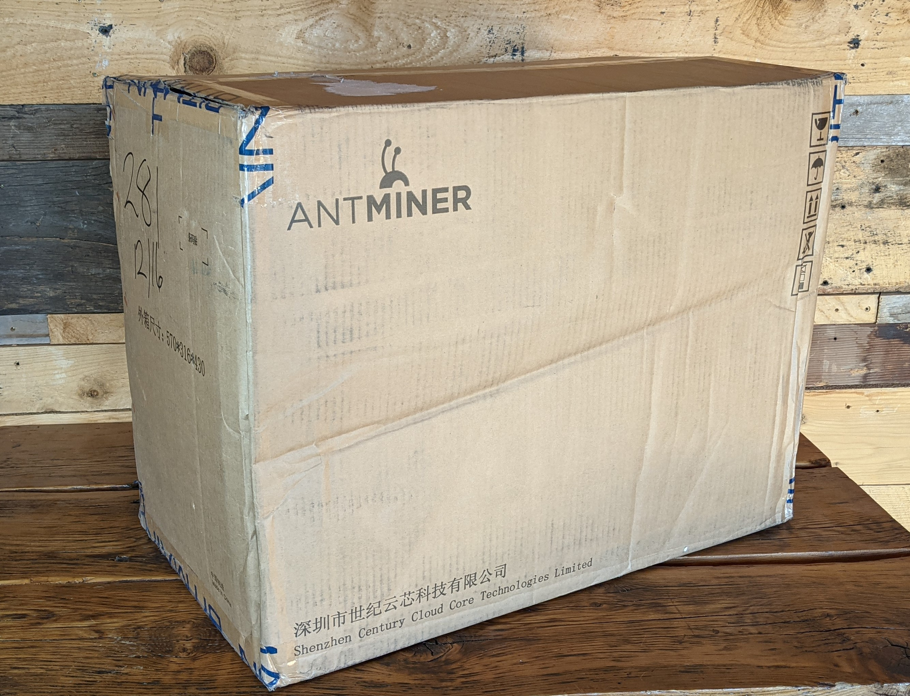
  

Check your box for external damage. If something doesn't look right, document the damage with pictures and contact the official Upstream Data sales team at [sales@upstreamdata.ca](mailto:sales@upstreamdata.ca) or [adam@upstreamdata.ca](mailto:adam@upstreamdata.ca). 

Inside the either box the ASIC will be packed with styrofoam:

  
  

Inside the styrofoam, either ASIC will be wrapped in a plastic bag:

  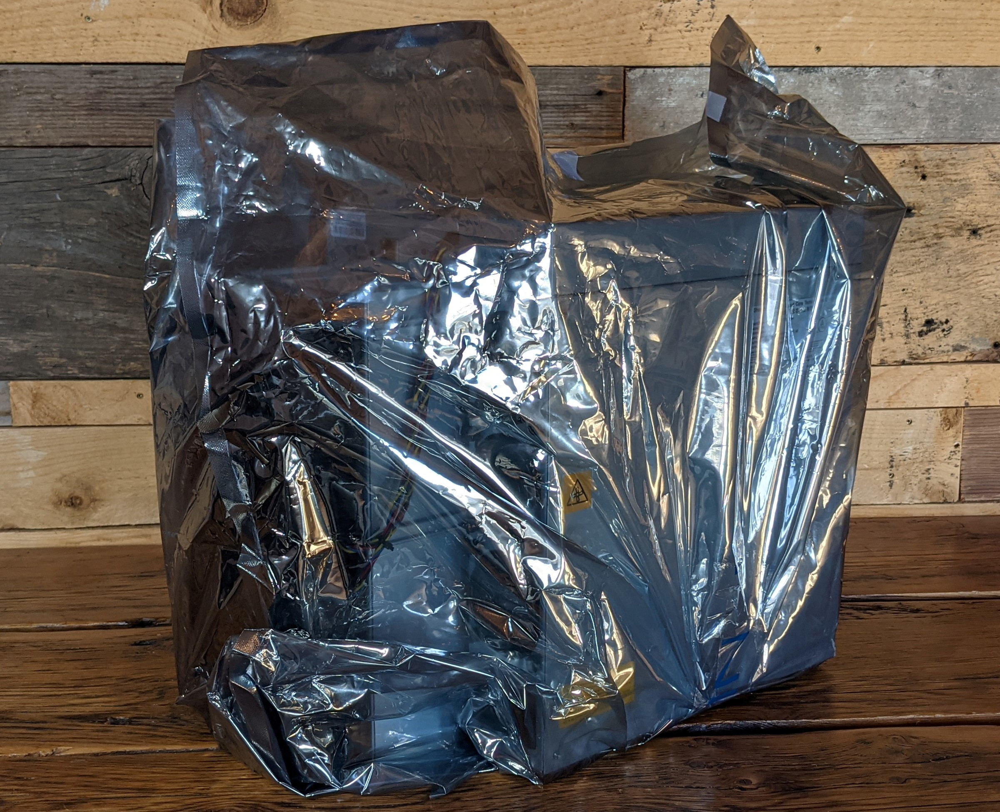
  

Inspect your ASIC for any visual signs of damage. Pick your ASIC up with both hands and a firm grip and shake it to see if there are any indications of loose pieces rattling around inside. 

  
  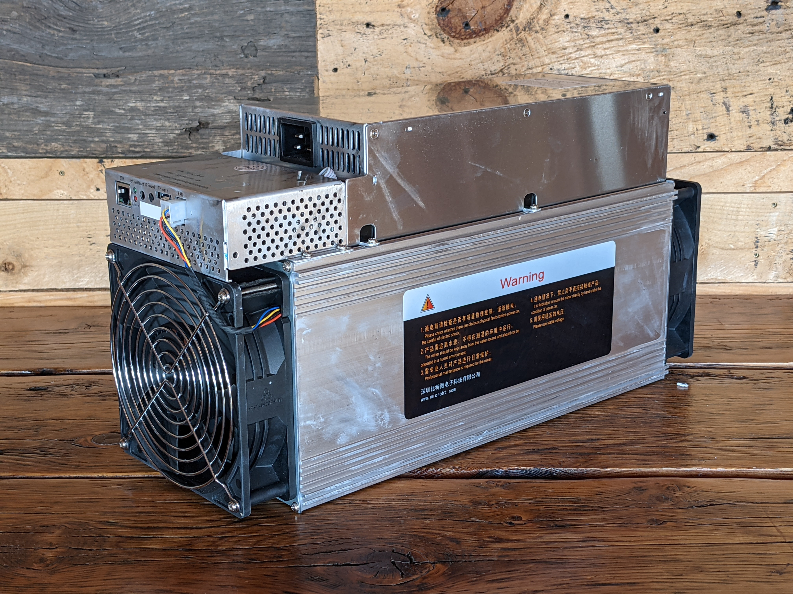

  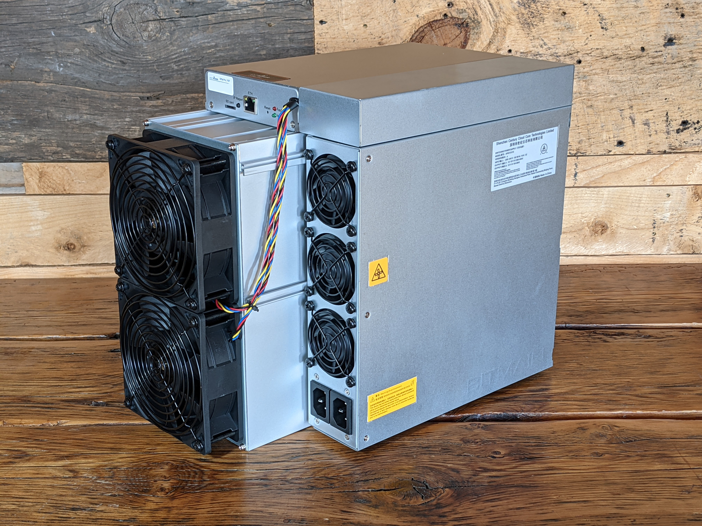
  

## Preliminary Checks
This is all very exciting, you have been waiting weeks for your ASIC and it is finally here. But do not rush this next part. Take a deep breath, slow down, and practice some of that low time preference Bitcoiners are known for. 

You just spent a small fortune on this hardware, it is worth your while to check a few things and ensure that nothing inside the ASIC came loose or shifted in transit. The last thing you want is to plug in your ASIC in and then see smoke come out. 

Basically there are three things you want to check:

1) That the wire harness connectors are seated and tight.
 
2) That the bus bars are tight and not touching each other.

3) That the hash board connections are seated and tight. 

* On the Antminer, remove the two screws on the electrical cover on the output side of the ASIC. Then you can slide the cover off in that direction. 

* On the Whatsminer, remove the four screws on the electrical cover on the input side of the ASIC. Also disconnect the fan wire harness. 

  
  

* On the Antminer, ensure the wire harness connections under the electrical cover are seated and tight as well as the bus bars.

* On the Whatsminer, ensure the wire harness connections under the electrical cover and on the underside of the electrical cover are seated and tight. 

  
  

* On the Antminer, remove the two small screws on both ends of the larger electrical cover. Lift the larger electrical cover off the Antminer and ensure the wire harness connections are all tight and seated on the circuit board, the bus bars are tight and not touching each other, and that the hashboard connections are seated and tight.

  
  

* On the Whatsminer, ensure the bus bars are tight and not touching each other. Then remove the four screws attaching the intake fan to the ASIC body and ensure the hashboard connections are seated and tight. 

  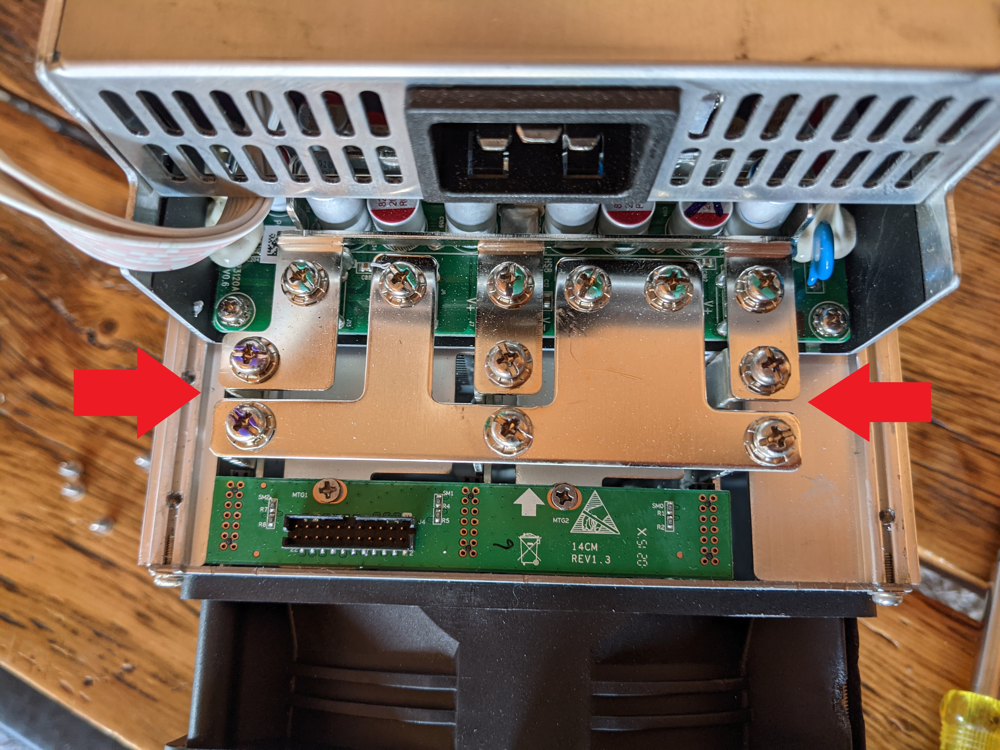
  

If you find any wire harness connectors loose, tighten them back into place. If you find that the bus bars have shifted in transit, loosen all the screws on that bus bar and realign it properly so it is not touching the other bus bars and tighten it back down. Then put everything back together the opposite of the way you took it apart. Then set your ASIC aside for now, this is a good time to get your mining pool account setup and configured prior to starting up your ASIC.

## Creating a SlushPool account
Mining solo is possible but very unlikely to yield bitcoin rewards. The chances of a solo miner solving for a block are very low and it is more likely that you will just run your ASIC indefinitely without ever solving for a block. Although, it is not impossible, as witnessed on June 3, 2020 at block height [632928](https://twitter.com/ckpooldev/status/1268334893466976257). But for most intents and purposes, you will want to connect to a mining pool so that you can maintain more steady rewards over time. With a mining pool, your rewards will be proportional to the amount of hash power you provided the pool. 

There are several different pools to choose from but the basic idea is the same with most of them. You will create an account, provide a bitcoin deposit address, and then copy/paste the mining pool URL into your ASIC configuration file so that your hash power is pointed there. Mining pools typically retain a small fee of your rewards between 1% - 3%. Then you receive rewards based on the number of blocks the pool finds and your proportional contribution to the pool during those block finds. You can learn more about mining pools [here](https://miningpools.com/bitcoin/).

In this guide, [SlushPool](https://slushpool.com/en/home/) will be covered. Some background on SlushPool is that they were the first Bitcoin mining pool, they supported small blocks during the block wars, they were the first pool to signal for taproot activation, they have a user-friendly dashboard and mobile app. Additionally, SlushPool pushes development of the [BraiinsOS](https://braiins.com/) firmware which can be used to make your Antminer perform better. BraiinsOS is not available for Whatsminers yet but will be soon. 

To get started with SlushPool, first navigate to [https://slushpool.com/en/home/](https://slushpool.com/en/home/) and click on `SIGN UP` in the upper left-hand corner. 

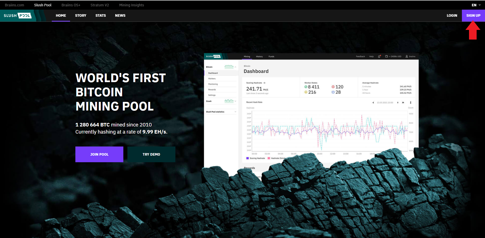

Then you can input an email address, username, and create a strong password. You may want to make considerations about using an email or username that do not reveal personally identifiable information about you. A confirmation email will be sent to the provided email address. 

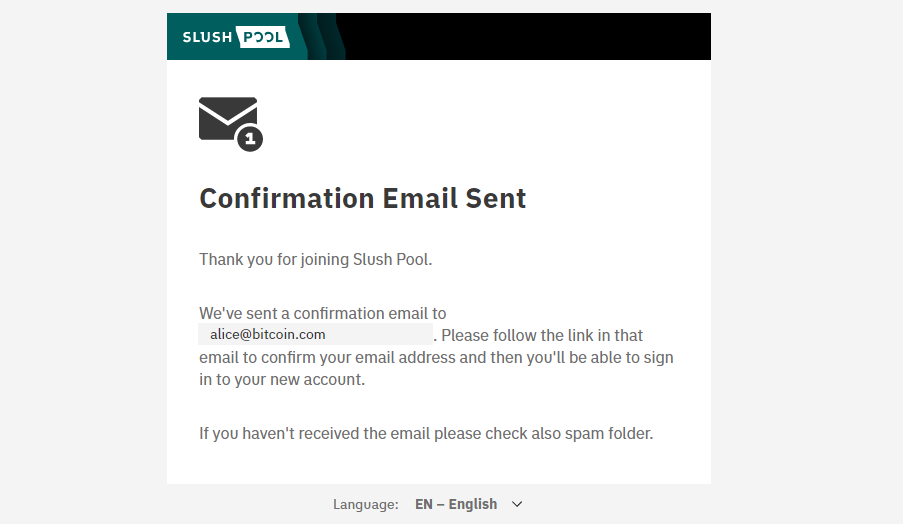

Open the confirmation email that was sent to you by SlushPool and click on the confirmation link. That link will bring you to the SlushPool log in page where you can enter your username and password. You will likely be presented with a Captcha. 

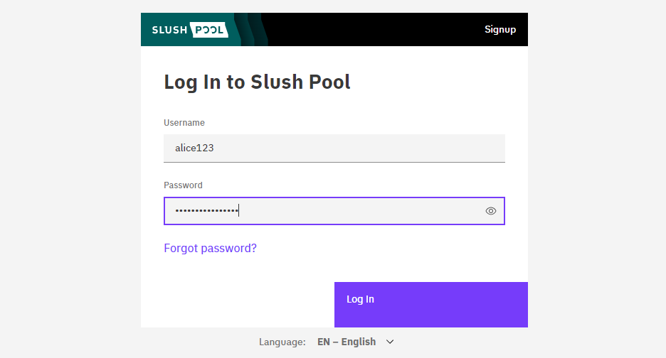

After successfully logging in, you should now be looking at your new SlushPool dashboard. The first thing you want to do is setup your rewards payout. Navigate to the `Funds` tab in the upper menu bar. 

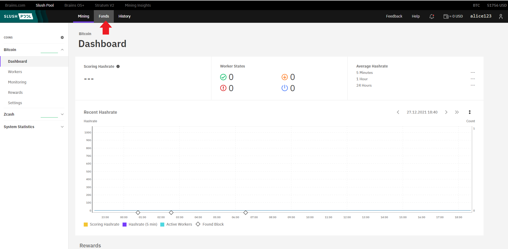

Next, navigate to the row labeled `Bitcoin Account` and on the right-hand side click on the `Set up` hyperlink. Then click on the `Create New Wallet` option. Then fill in a wallet name, your bitcoin deposit address from your preferred wallet, and select either a `Trigger Type` of `threshold` or `time interval`. With small scale mining operations it may make more sense to use the `threshold` option so that once the accumulated rewards exceed a specified threshold, the payout is made. Specifying a threshold value lower than 0.01 bitcoin will result in a small fee. Then click on `Confirm Changes`.  

You will be asked to confirm your SlushPool password and you will be sent a confirmation email asking for you to confirm the deposit address change. After clicking on the confirmation link in your email, you will be directed to a new SlushPool window and you will see that your changes have taken effect. 

That is the process for updating your payout address. There are privacy benefits to only using addresses one time, so consider updating this address between each payout. At this point your SlushPool account is all setup and ready to use. This is a good time to do the initial startup with your ASIC and then the configuration can be set to your new SlushPool account.

## Initial Startup
As soon as you plug the ASIC into power it will start running. There is no on or off switch. So long as it has power it will run. During the initial start up you want pay attention to the air flow of the fans on your ASIC as soon as you start it up. If one of the fans are installed backwards then you want to immediately unplug the ASIC and fix that before proceeding. Keep your fingers away from moving fan blades. 

Make sure the Ethernet connections and power cable connections are seated and tight.

1) Plug in an Ethernet cable to the back of the ASIC and connect the other end to your router or switch.
 
2) Plug the power cable in to the back of the ASIC then connect the other end to the outlet.

3) Ensure the air flow is moving the right direction. 

If you hear any rattling sounds or smell something burning immediately unplug the ASIC. 

 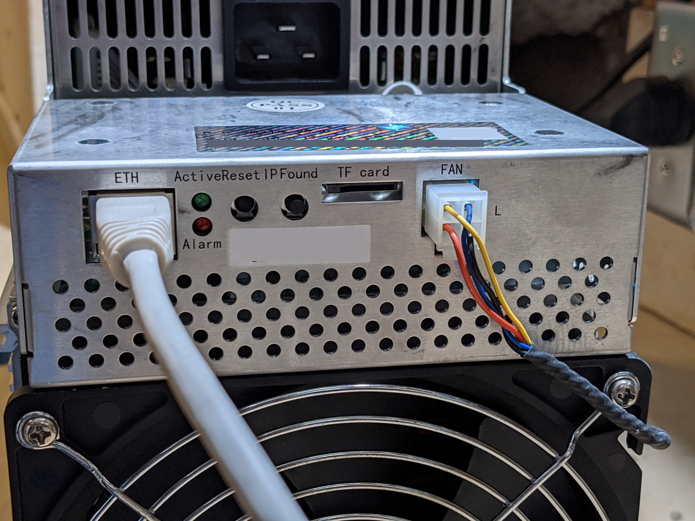
  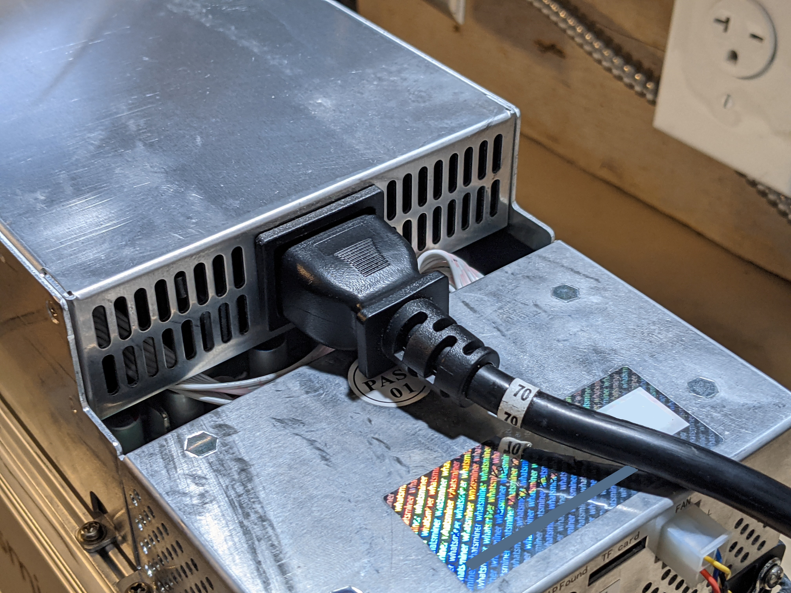
   

[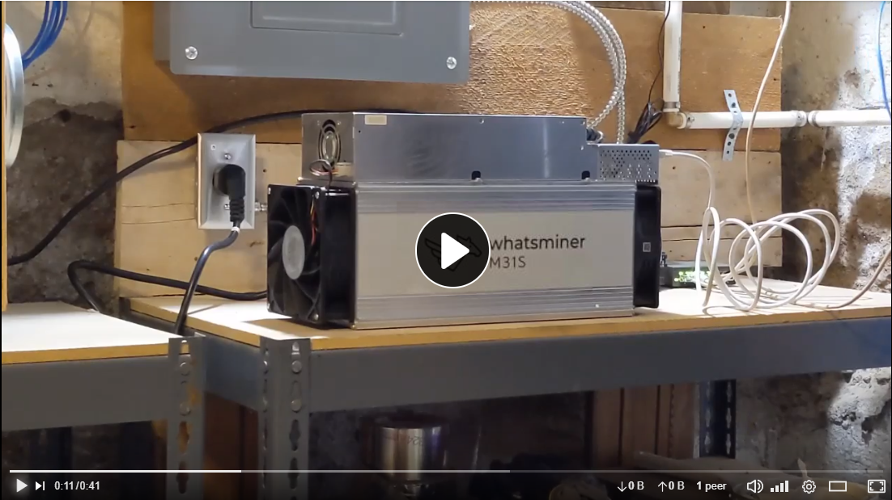](https://youtu.be/DKJQspEmkuA "Whatsminer Startup")

Once the ASIC is running then the initial miner configurations can be made. To power down the ASIC, unplug the Ethernet cable and wait a few minutes for the ASIC to go into standby mode where it will spool down the fans to a low idle. Then wait a few more minutes for the hashboarsds to cool off and then unplug the power cable.  

## Miner configuration
In order to configure your ASIC you will need to be able to communicate with it. The easiest way to do this is to use a web browser to log into your ASIC from a computer connected to the same local network. Once connected and logged into the ASIC you can make the necessary changes to connect to the mining pool. 

First you will need the local IP address for your ASIC. This can be found by logging into your router and checking the list of devices under the DHCP leases section. Your router should have the local IP address needed to log into it along with the password on a label somewhere on the device. If not, the directions are usually pretty easy to find with an online search for your manufacturers router. Typically, you can just type `192.168.0.1` or `192.168.1.1` or `10.0.0.1` into your web browser and that will bring you to your router login page. From there the username/password can vary depending on manufacturer but they are usually something like `admin/admin` or `admin/1234` or `admin/password`. Alternatively, programs like [AngryIP](https://angryip.org/) may be used. 

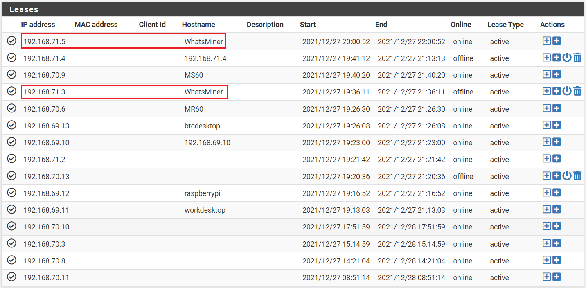

Once you have your ASIC's local IP address then you can just type that into your web browser URL bar and then you may be warned about how this is not a trusted connection. This is a self signed certificate so just accept the risk and continue. 

 
  

  

Once you are at the Antminer login page the username/password should be `root/root`. From the Whatsminer login page the username/password should be `admin/admin`.

Once logged in to the Whatsminer, a few important statistics to note are the Giga Hash Average: `GHSav`, the Intake Fan Speed: `FanSpeedIn`, the Exhaust Fan Speed: `FanSpeedOut`, the Power Consumption in Watts: `Power`, and the Hash Board Temperatures: `Temperature`. 

It can take several minutes to an hour for the ASIC to get up to speed and fully hashing, in the mean-time you can get started on connecting your ASIC to SlushPool. 

## Connecting to SlushPool
In the Whatsminer configuration page, you will be able to link three mining pools. Only one can be used at a time but the other two are there as failovers in case a mining pool server goes down. The username you use for your "worker" (your ASIC) should be the same as your SlushPool username.

Navigate to `Configuration` > `Miner Configuration`

Next, this is the page where you will make your mining pool and username configurations. In the Whatsminer configuration page it is important to click on <kbd>Save & Apply</kbd> in between each change you make. Then at the end after all the changes have been made, the ASIC gets a reboot and the changes are applied. 

In another tab, log into your SlushPool account if you haven't already. Then navigate to the `Workers` tab in the left-hand side menu and click on `Connect Workers +`.

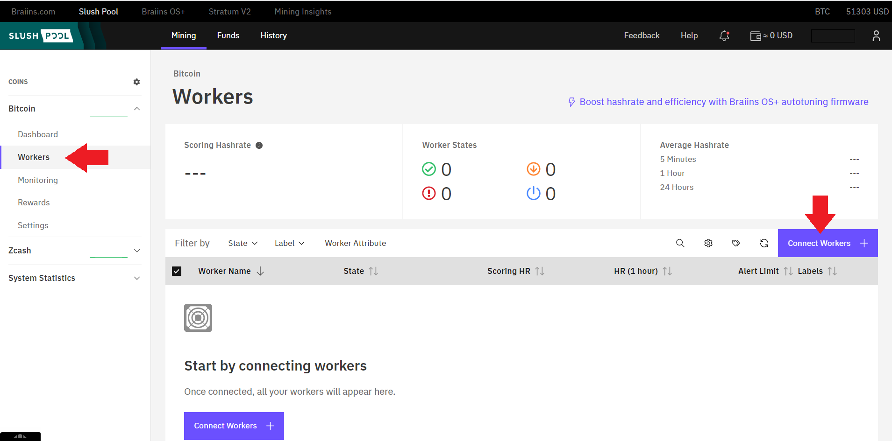

This will bring up a page where you can choose the SlushPool server that is closest to your geographic location. Choosing a server that is far from you can introduce latency which reduces mining rewards. For the Whatsminers, make sure you have `Stratum V1` selected. Only use `Stratum V2` if you have done the BraiinsOS firmware upgrade on your Antminer. You will also notice that SlushPool suggests that you name your ASIC `username.worker1` in your ASIC configuration page. So in this example, the SlushPool username is `alice123` therefore the ASIC configuration will be setup so that the ASIC is named `alice123.worker1`. Also of note is that the password in the configuration page can be anything such as `1234`, there is no security precaution with this password, it is used as a way to prevent the mining pool servers from getting spammed. 

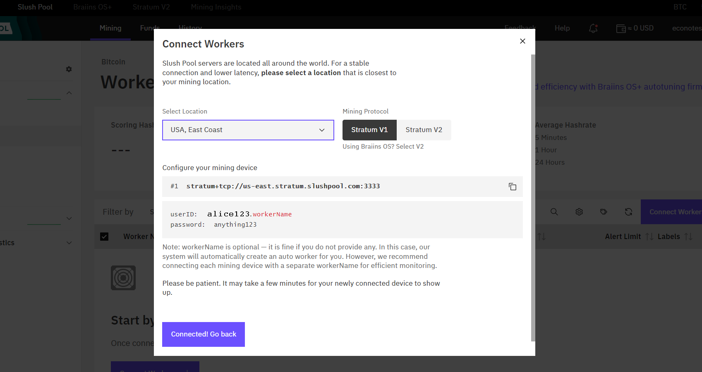

Copy/paste the first nearest SlushPool server into your ASIC configuration file by navigating to the `Pool 1` drop down menu and selecting `-- Custom --` and then pasting the SlushPool URL there. Then click on `Save & Apply` before making any other changes. 

 
  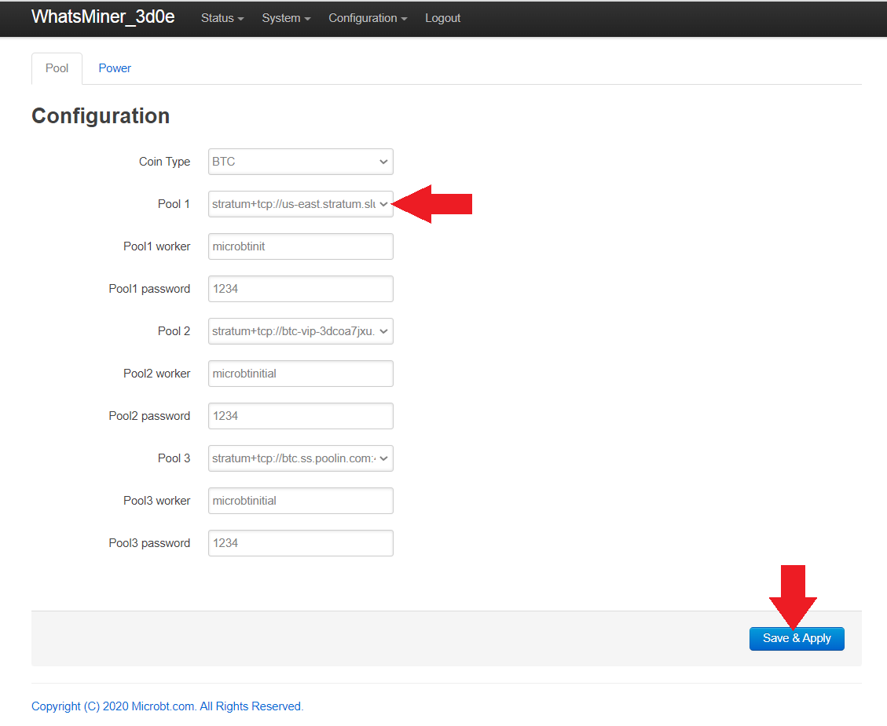

 

Next, name your ASIC using your SlushPool username followed by `.worker1` for example, `alice123.worker1`. Then click on `Save & Apply` before making any other changes. 

Repeat this process for the other two failover servers, picking a different server for each. Keep the worker name and password the same for each. 

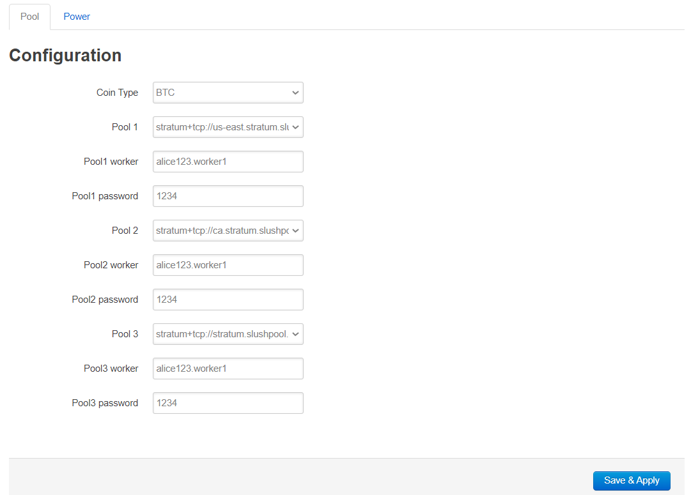

The ASIC needs to be rebooted in order for these changes to take effect. Navigate to `System` > `Reboot` then click on the <kbd>Perform reboot</kbd> button. You will be logged out of the interface and the ASIC will reboot. You will hear the fans spool up and down a couple times. Then you can log back into the ASIC interface. 

 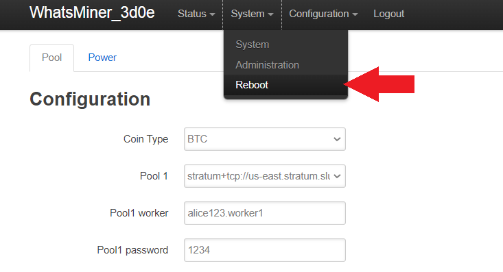
  

 

After a few minutes and as long as 90 minutes, you should start to see activity showing up in your SlushPool dashboard. Do not be alarmed if the hash rate is low or if the worker is showing as `Offline` or `Disabled`, it can take a long time for everything to connect and settle down. 

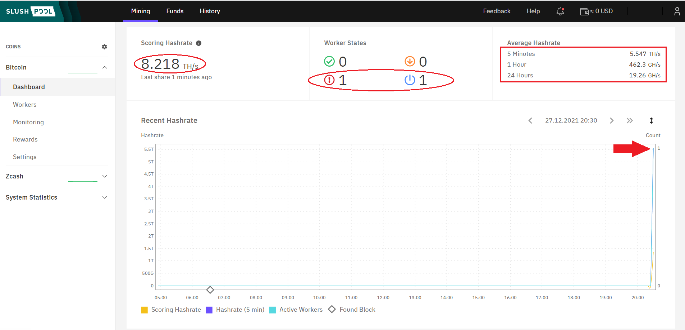

At this point, simply monitor both your SlushPool dashboard and the ASIC web interface to ensure that the amount of hash being generated at the interface is reaching the dashboard. 

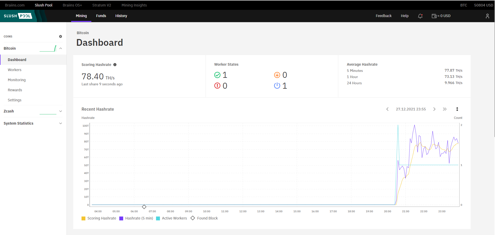

Keep in mind that the prominently displayed hash rate score on the SlushPool interface is your scoring rate which is made of averages. So do not be surprised if this number is significantly lower than the hash rate reading you get from the web interface on your ASIC. A more accurate metric to watch is in the upper right-hand corner of your SlushPool dashboard, the `5 minute`, `1 hour`, and `24 hour` averages. 

## Setting up the BlackBox (coming soon)

