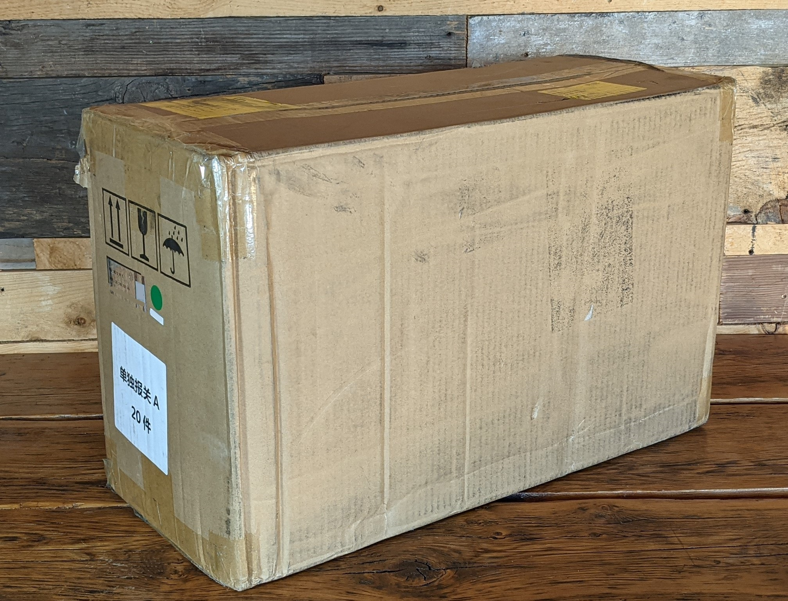
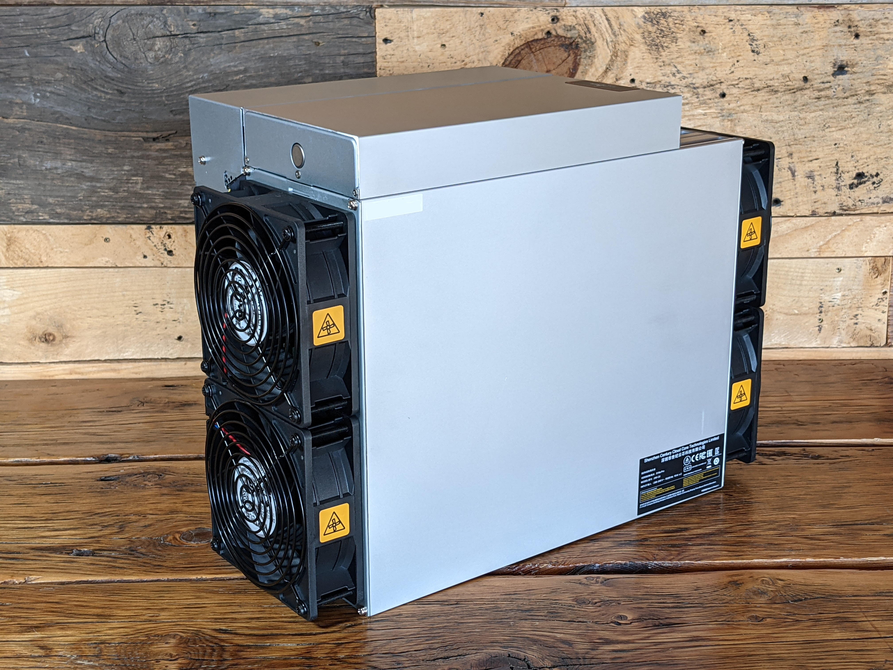
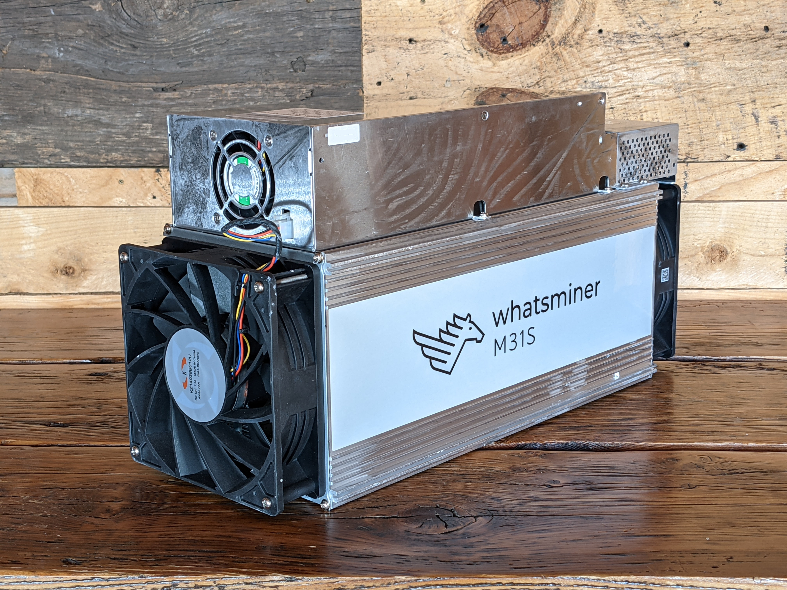
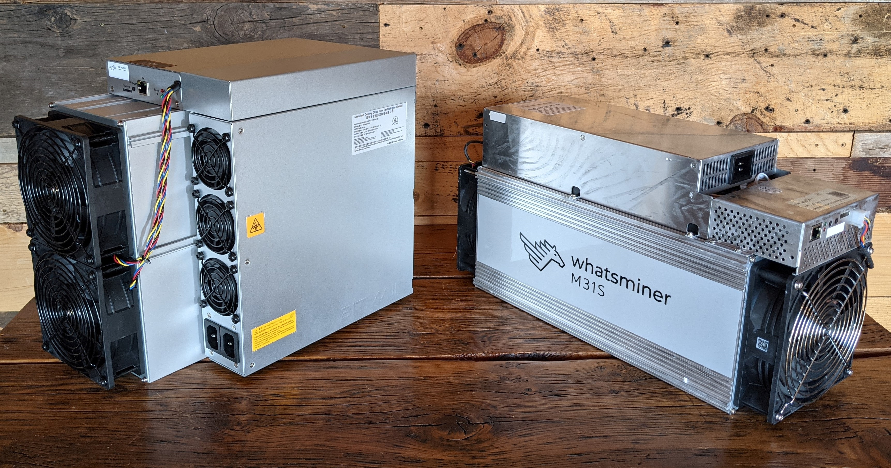

# UpstreamData Startup Instructions for Whatsminer M30S & Antminer S19 Pro
Congratulations on starting your Bitcoin mining journey with Upstream Data! Please take a few minutes to read this guide for helpful tips & tricks to get you started on the right foot. If you have any questions, feel free to reach out in the [Upstream Data Customer Support Telegram channel](https://t.me/OhmmMiningSupport). This guide is meant as referrence material for Upstream Data BlackBox Bundle customers who are receiving their ASICs now with an expected delivery of their BlackBox in the near future. You should be getting either a Whatsminer M30S+ or Antminer S19 Pro, those are the only ASICs referrenced here. 

  

  

This guide will cover these topics:
- Basic electrical requirements
- Unboxing 
- Preliminary checks
- Initial startup
- Creating a SlushPool account
- Miner configuration
- Connecting to SlushPool
- Setting up the BlackBox (coming soon)

## Basic Electrical Requirements
Electrical is no joke, hundreds of people across North America die each year from electrocution. Safety standards are there for a reason and you need to consult with a licensed electrician to ensure your installation meets the minimum safety requirements. Hiring a licensed electrician is not as expensive as you might think. You just spent upwards of $10,000 on your ASIC, the last thing you want to do is fry it; or worse cause damage to your home, your loved ones, or yourself. 

The information provided here is refrrence material only. This information is provided to give you a basic understanding of the materials involved and how they are configured so that you can have a well-informed discussion with your licensed electrician and forecast your budget better. The information provided here is not meant as Do-It-Yourself (DIY) instructions. 

Understanding the electrical infrastructure starts with understanding your Bitcoin mining hardware. The links lead to the manufacturer's specification pages for more details. 

[Whatsminer M30S+](https://whatsminer.com/mall/parts/38.html)
- Power Supply Unit: P21E 
- Operating Voltage: 200 volts to 277 volts (240 volt)
- Wattage: 3,400 Watts
- Amperage: ~15 amps

[Antminer S19 Pro](https://support.bitmain.com/hc/en-us/articles/900000261726-S19-Pro-Specifications)
- Power Supply Units: APW121215
- Voltage: 200 volts to 240 volts (240 volt)
- Wattage: 3,250 Watts
- Amperage: ~14 amps

To calculate amps take the wattage divided by the voltage, for example: `3,400 ÷ 240 = 15 amps`

With this basic information, we can start to understand the minimum requirements of the electrical infrastructure. One important concept here is the 80% rule. In electrical circuits with a continuous load such as an ASIC that runs 24/7, the consumption should never exceed 80% of the circuit capacity.

Observing the 80% rule, to calculate what the circuit should be rated for, multiply the amperage by 1.25, for example: `15 x 1.25 = 18.75` which should be rounded up to the nearest standard, 20 amps in this case.

Whether you have a Whatsminer or an Antminer, you will want to have a circuit that is rated for at least 20 amps. This means you will want a 240 volt, 20 amp circuit breaker, 20 amp outlets, and 12 gauge cable. Here is an example of some common materials that meet these specifications:

  

Let's break down what we see in this picture and why:
* [Nema 6-20 Outlets](https://www.mcmaster.com/7120K88/), rated for 250 volts, 20 amps, commonly available Nema specification for power cables.
* [HOM Style 20A 240V Circuit Breaker](https://www.mcmaster.com/69225K4-69225K75/), for Square D brand panels. If you have a Siemans brand panel, you want the [QP style breaker](https://www.mcmaster.com/5259T5-5259T52/). Or if you have a Cuttler-Hammer brand panel, you want the [CH style breaker](https://www.mcmaster.com/5259T8-5259T82/).
* [12/2 MC Cable](https://www.mcmaster.com/6730T24-6730T243/), rated for 600 volts, 20 Amps, 12 AWG THHN 90° cable, metal jacket means it can be ran on the exterior of walls and still meets code.
* [MC Cable Connectors](https://www.mcmaster.com/7969K21/), easily terminate the MC cable to the electrical panel and outlet box 1/2" knockouts.   
* [Outlet Box](https://www.mcmaster.com/71695K21/), robust steel construction, 10x 1/2" knockouts for a variety of configurations. 
* [Wall Plate](https://www.mcmaster.com/8033K81-8033K13/) "unbreakable" Nylon construction, looks clean once installed. 

For a Whatsminer, you only need one outlet. But for the Antminer, you need two outlets because it has two power supplies. Now don't let this get you all confused, the whole ASIC still only consumes ~14 amps, each power supply is pulling ~7 amps. Also, both outets can be installed on the same 20 amp circuit like I have demonstrated here:

  

Your ASIC will most likely not include a power cable, the Whatsminers need a C19 connection and the Antiminers need a C13 connection. If you installed 6-20 outlets then these are the power cables you want:

1 x [C19 to 6-20 cable for a Whatsminer](https://www.amazon.com/NEMA-6-20P-Power-Cord-IBX-4937-01-C/dp/B07BZS7VQG/ref=sr_1_1_sspa?crid=217EW29IF29BN&keywords=nema%2B6-20p%2Bto%2Bc19%2Bpower%2Bcord&qid=1640238622&s=electronics&sprefix=nema%2B%2Celectronics%2C164&sr=1-1-spons&spLa=ZW5jcnlwdGVkUXVhbGlmaWVyPUFOUzUxMVpWRFEwTUcmZW5jcnlwdGVkSWQ9QTA2MDIxMDMzMlZNWUZIUzhTMVVCJmVuY3J5cHRlZEFkSWQ9QTA5ODMzMjlJSTgxMUhLSUFaTTUmd2lkZ2V0TmFtZT1zcF9hdGYmYWN0aW9uPWNsaWNrUmVkaXJlY3QmZG9Ob3RMb2dDbGljaz10cnVl&th=1)

2 x [C13 to 6-15 cable for a Antminer](https://www.amazon.com/NEMA-6-15P-Power-Cord-IBX-4933-06-C/dp/B07DGM3NXY?th=1) (the 6-15 fits in the 6-20 outlet, C13 specifications do not exceed 15 amps)

If you are lucky, your Whatsminer might come with a Nema 10-20 to C19 power cable. If that is the case and you want to use that included power cable, then you will want to use the [10-20 outlet](https://www.mcmaster.com/7120K95/). 

That should give you a basic understanding of your electrical requirements to discuss with your licensed electrician. Now you should be ready to open your ASIC and check a few things before powering it on. 

## Unboxing
Here is what you can expect upon receiving your ASIC. The Antminer will be shipped in a box that reads "Antminer" on the side and has the word "Bitmain" printed on the packing tape. Not great for opsec so be prepared for that. The Whatsminer ships in a plain box with only a small holographic sticker on it with any indication of the contents.

The Antminer box measures 22"L x 17"H x 13"W. The Whatsminer box measures 21"L x 14"H x 9"W. 

  
  

Check you box for external damage. If something doesn't look right, document the damage with pictures and contact the official Upstream Data sales team at sales@upstreamdata.ca
or adam@upstreamdata.ca. 

Inside the box either ASIC will be packed with styrofoam:

  
  

Inside the styrofoam the either ASIC will be wrapped in a plastic bag:

  
  

Inspect your ASIC for any visual signs of damage. Pick your ASIC up with both hands and a firm grip and shake it to see if there are any indications of loose pieces rattling around inside. 

  
  

  
  

  

## Preliminary Checks
This is all very exciting, you have been waiting weeks for your ASIC and it is finally here. But do not rush this next part. Take a deep breath, slow down, and practice some of that low time preference Bitcoiners are known for. 

You just spent a small fortune on this hardware, it is worth your while to check a few things and ensure that nothing inside teh ASIC came loose or shifted in transit. The last thing you want is to plug in your ASIC in and then see smoke come out. 

Basically there are three things you want to check:

1) That the wire harness connectors are seated and tight. 
2) That the bus bars are tight and not touching eachother.
3) That the hash board connections are seated and tight. 

* On the Antminer, remove the two screws on the electrical cover on the output side of the ASIC. Then you can slide the cover off in that direction. 

* On the Whatsminer, remove the four screws on the electrical cover on the input side of the ASIC. Also disconnect the fan wire harness. 

  
  

* On the Antminer, ensure the wire harness connections under the electrical cover are seated and tight as well as the bus bars.

* On the Whatsminer, ensure the wire harness connections under the electrical cover and on the underside of the electrical cover are seated and tight. 

  
  

* On the Antminer, remove the two small screws on both ends of the larger electrical cover. Lift the larger electrical cover off the Antminer and ensure the wire harness connections are all tight and seated on the circuit board, the bus bars are tight and not touching eachother, and that the hashboard connections are seated and tight.

  
  
  

* On the Whatsminer, ensure the bus bars are tight and not touching eachother. Then remove the four screws attaching the intake fan to the ASIC body and ensure the hashboard connections are seated and tight. 

  
  
  

